# antennas / antennae

> **그룹**: 규칙형 우세 그룹  
> **3층위 요약**: 1차 `규칙형 우세` → 2차 `우세 전환` → 3차 `의미 분화`

*대표 이미지: antennas / antennae Google Ngram 장기 사용량. 형용사·명사 연어 그래프와 COCA 맥락 캡처 등 나머지 이미지는 아래 [참조 이미지](#참조-이미지)에 정리했다.*

## 1. 결론

*antennae*와 *antennas*는 동일한 형태에서 출발했으나, 생물학적 전문 용어와 기술·공학적 일반 용어라는 서로 다른 방향으로 분화되었다. *antennae*는 곤충학·생물학의 전문 용어로 제한되는 반면, *antennas*는 무선 통신·가전·우주 통신과 결합하며 현대 영어의 기술적 표준 복수형으로 자리 잡았다. 즉 고전형과 규칙형이 단순히 경쟁하는 데 그치지 않고 의미·사용 영역의 분화를 통해 장기 공존하는 사례로, **규칙형 우세 → 우세 전환 → 의미 분화**에 속한다.

## 2. 연구 결과

| 층위 | 분석 축 | 결과 |
| --- | --- | --- |
| 1차 | 현재 사용 상태 | 규칙형 우세 |
| 2차 | 변화의 속도·방향 | 우세 전환 |
| 3차 | 작동 메커니즘 | 의미 분화 |

## 3. 과정 및 결론 도달 과정 (사용 도구)

1차 **Ngram 사용량 그래프**로 초기 우세 형태(고전형)와 역전 시점을, 2차 같은 그래프로 역전을 동반한 **우세 전환** 경로를 읽었다. 3차는 **Ngram 형용사·명사 연어**(생물학 vs 통신공학)와 **COCA 맥락 분석**으로 두 형태가 서로 다른 의미 영역에 배분되었음을 확인했다.

## 4. 세부 정보 (구간 별 분절)

### 4-1. 1차 — 현재 사용 상태 (Google Ngram 사용량)

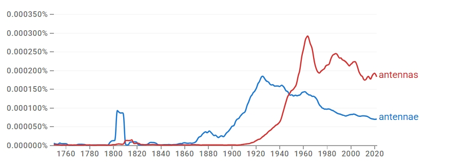

초기에는 고전형 *antennae*가 상대적으로 우세하며 19세기 후반~20세기 초반까지 상승한다. 규칙형 *antennas*는 20세기 초까지 매우 낮은 수준에 머물다 1930년대 이후 급증하여 1950년대 전후 *antennae*를 추월한다. 이후 사용량의 중심은 규칙형 *antennas* 쪽으로 뚜렷하게 기울어진다.

### 4-2. 2차 — 변화의 속도·방향

일시적 변동이 아니라, 일정 기간 병행 사용을 거친 뒤 규칙형이 상대적 우위를 점하는 방향으로 전개된 **우세 전환**의 경로다.

### 4-3. 3차 — 작동 메커니즘 (연어 + COCA)

*antennae*는 *long, male, female, segmented* 및 *insect/filiform antennae*와 결합해 곤충학·형태학·생물 분류학과 연결되고, *antennas*는 *directional, multiple, parabolic* 및 *array/microstrip/dipole antennas*와 결합해 통신·전자공학과 결부된다. COCA에서도 *antennae*는 생물학적 기관과 그 은유적 확장(*political/emotional antennae*)에 남고, *antennas*는 통신·공학 장비의 기술적 표준형으로 확장된다. *radio/radar antennae* 같은 기술적 잔존 용례가 일부 확인되므로 완전 분리라기보다, 역사적 중첩을 거친 뒤 현대에 들어 고전형=생물학, 규칙형=공학으로 배분된 **의미 분화**다.

### 4-4. 역사적 제언

*antennae*는 곤충·갑각류의 더듬이를 가리키는 생물학 용어로 정착하며 그 형태가 유지된 반면, 통신 장치를 가리키는 기술적 의미가 확장되면서 규칙형 *antennas*가 채택되었다.

## 참조 이미지

본문에는 대표 이미지(Ngram 사용량) 1개만 두고, 아래 연어 그래프 및 COCA 맥락 캡처는 참조로 분리한다.

### Google Ngram 연어 분석

- **형용사 연어 — 규칙형**  
  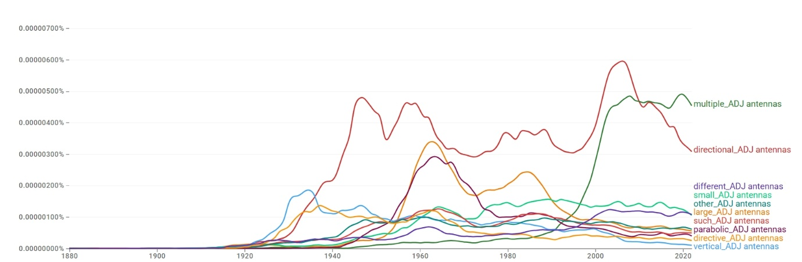
- **형용사 연어 — 고전형**  
  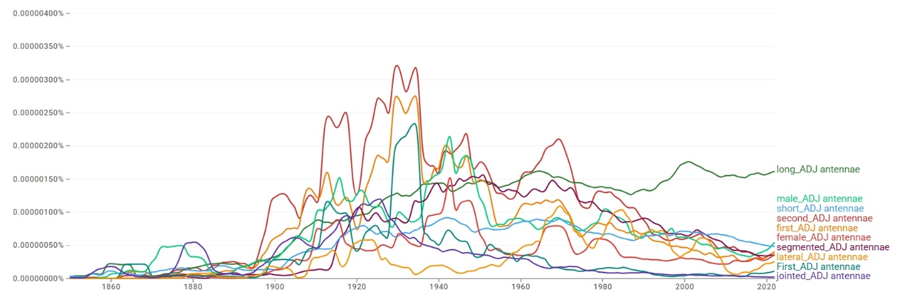
- **명사 연어 — 규칙형**  
  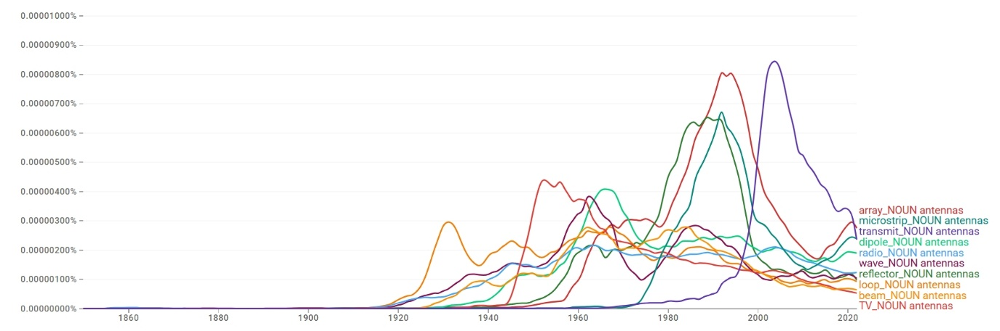
- **명사 연어 — 고전형**  
  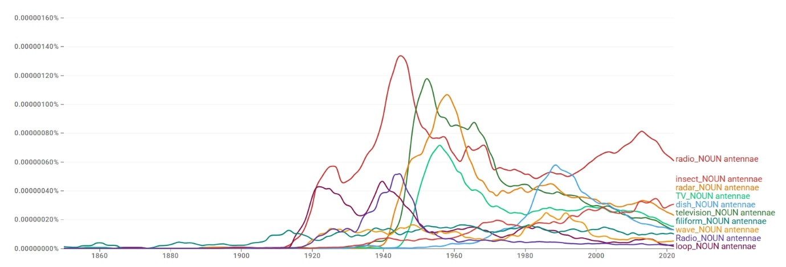

### COCA 맥락 분석

**규칙형:**

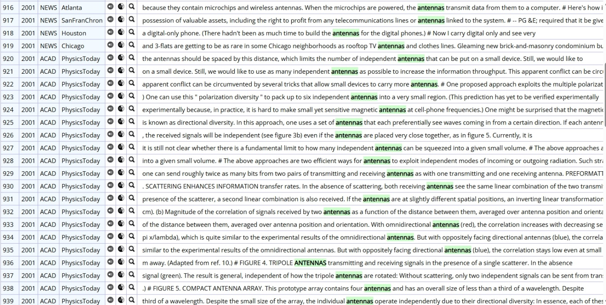

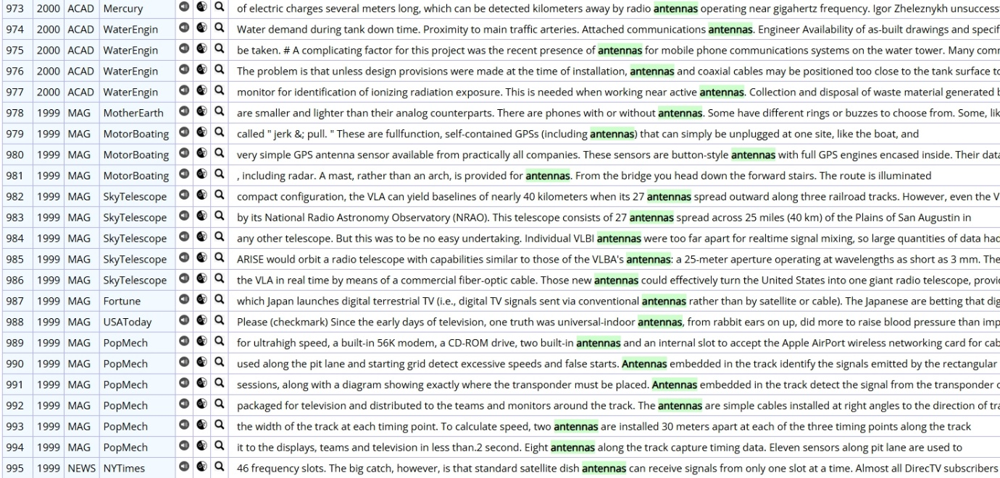

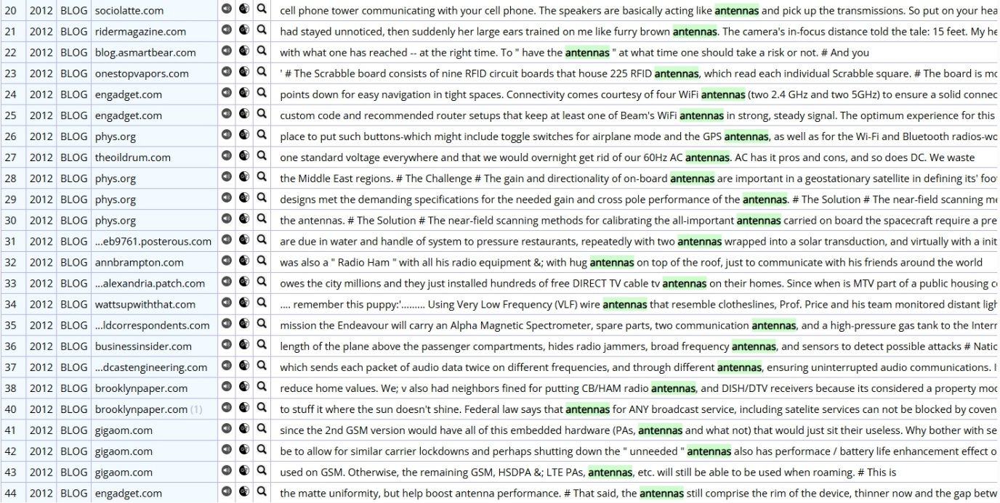

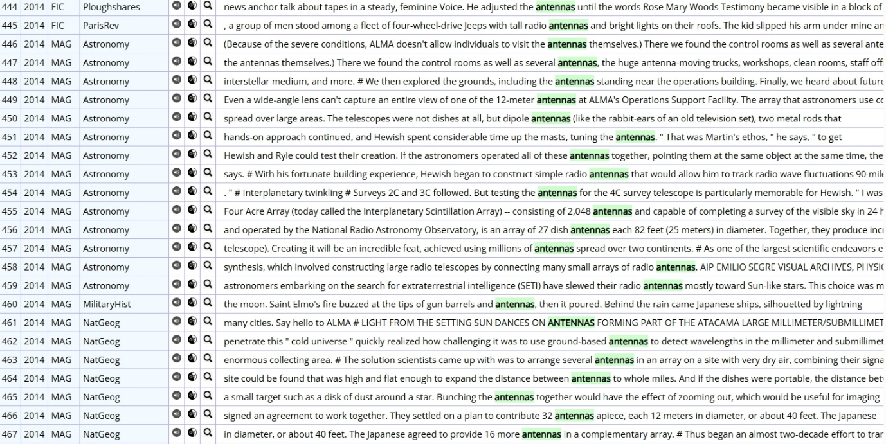

**고전형:**

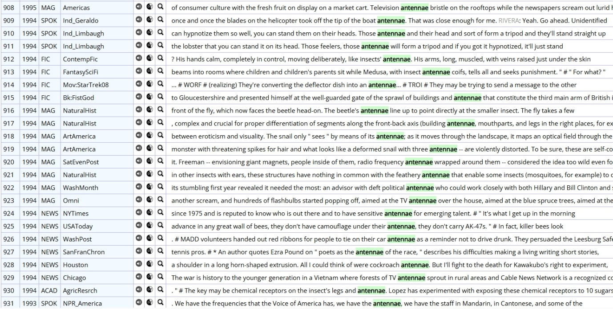

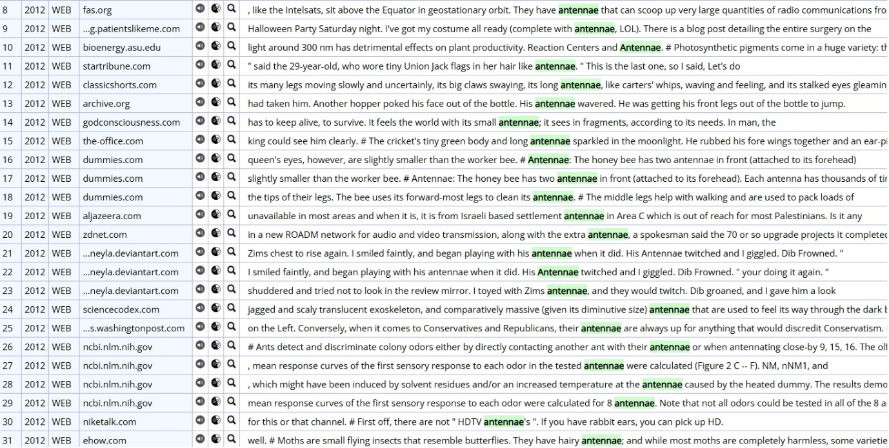

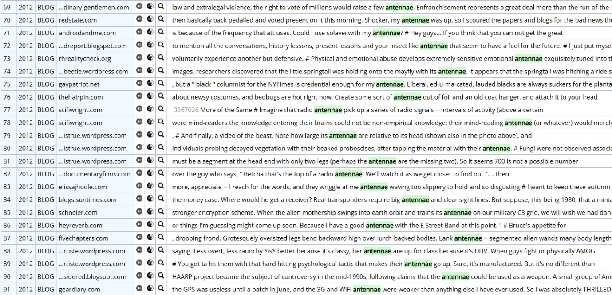

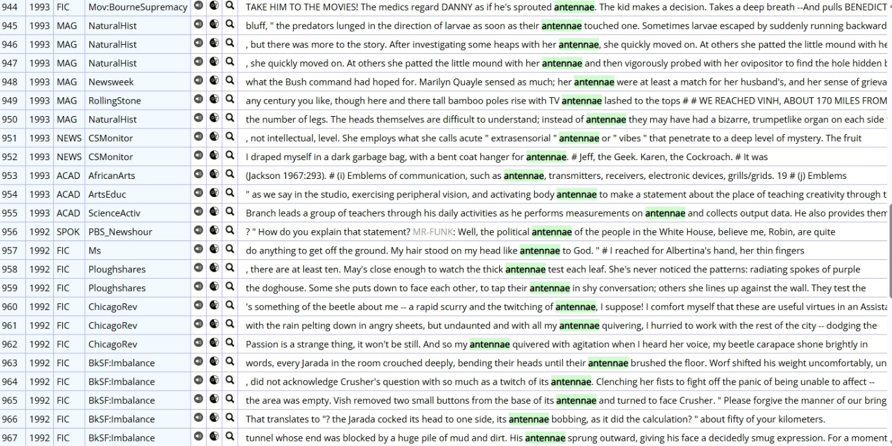

---

[← 전체 사례 목록으로](../README.md#사례-분석) · [방법론](../docs/methodology.md) · [결론 및 제언](../docs/conclusion.md)
