# aquaria / aquariums

> **그룹**: 공존 그룹  
> **3층위 요약**: 1차 `공존(초기 고전형 우세)` → 2차 `우세 전환` → 3차 `register 분화`

*대표 이미지: aquaria / aquariums Google Ngram 장기 사용량. 형용사·명사 연어 그래프와 COCA 맥락 캡처 등 나머지 이미지는 아래 [참조 이미지](#참조-이미지)에 정리했다.*

## 1. 결론

*aquariums*와 *aquaria*는 ‘수조·수족관’이라는 동일 의미 영역을 공유하지만, 시간이 지나며 중심 형태와 사용 환경이 분명히 달라진다. 초기에는 고전형 *aquaria*가 자연사·연구·공공 전시의 문어적·전문적 맥락에서 우세했으나, 20세기 중후반 이후 가정 취미·소비재·대형 공공 수족관·관광 담화가 확대되며 규칙형 *aquariums*가 더 넓은 기반을 확보한다. *aquaria*는 실험·사육 관리·기관 운영의 전문 맥락에 제한적으로 남는다. 따라서 **초기 고전형 우세 공존 → 우세 전환 → register 분화**의 구조다.

## 2. 연구 결과

| 층위 | 분석 축 | 결과 |
| --- | --- | --- |
| 1차 | 현재 사용 상태 | 공존(초기 고전형 우세) |
| 2차 | 변화의 속도·방향 | 우세 전환 |
| 3차 | 작동 메커니즘 | register 분화 |

## 3. 과정 및 결론 도달 과정 (사용 도구)

1차 **Ngram 사용량 그래프**로 초기 고전형 우세와 2000년대 전후 규칙형 추월을, 2차 같은 그래프로 교차·**우세 전환**을 통한 공존 경로를 읽었다. 3차는 **Ngram 연어**(public/family/home/reef vs experimental/laboratory/control)와 **COCA 맥락 분석**(공공 전시·취미·소비재 vs 실험·연구·기관 운영, 고유명사 용법 포함)으로 레지스터 분화를 해석했다.

## 4. 세부 정보 (구간 별 분절)

### 4-1. 1차 — 현재 사용 상태 (Google Ngram 사용량)

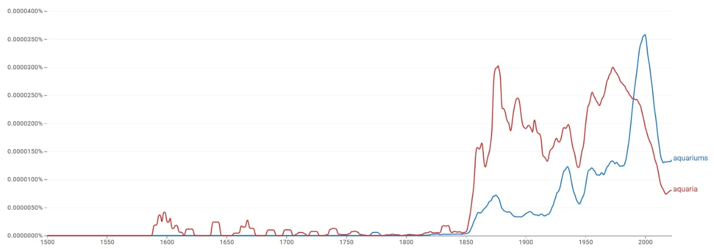

초기에는 두 형태 모두 거의 쓰이지 않으나, 19세기 후반 이후 고전형 *aquaria*가 먼저 증가해 20세기 전반까지 더 높은 사용량을 유지한다. 규칙형 *aquariums*는 19세기 후반부터 서서히 나타나 20세기 중반까지 대체로 낮다가, 1980년대 이후 상승세가 뚜렷해지고 2000년대 전후 *aquaria*를 추월한다. 현재 사용량의 중심은 규칙형 *aquariums* 쪽으로 이동했다.

### 4-2. 2차 — 변화의 속도·방향

한 형태가 단기간에 대체한 것이 아니라, 초기 고전형 우세에서 출발해 규칙형이 사용 기반을 넓히며 교차·**우세 전환**되어 공존하는 경로다.

### 4-3. 3차 — 작동 메커니즘 (연어 + COCA)

*aquariums*는 *public/large/family* 및 *home/saltwater/reef/community*와 결합해 가정용·취미·전시·소비재와, *aquaria*는 *marine/experimental/separate/aerated* 및 *laboratory/control/test/filter*와 결합해 연구·관리·제도적 사육 환경과 연결된다. COCA에서 *aquariums*는 공공 전시 시설·가정 취미·연구 환경·보전 교육·대중문화에 폭넓게, *aquaria*는 실험·연구·사육 통제·기관 운영의 문어적 맥락에 분포하되 게임 제목 등 고유명사 용법이 섞인다. 규칙형=대중·실용, 고전형=전문·관리로 갈리는 **register 분화**다.

### 4-4. 역사적 제언

고전형 *aquaria*는 자연사 연구와 전시 기관의 문어적·전문적 표현으로 자리 잡았으나, 가정용 사육 취미와 상업 수족관이 확산되면서 일상적·상업적 영역에서는 규칙형 *aquariums*가 널리 쓰이게 되었다. 그 결과 사용량의 중심은 *aquariums*로 이동하되, *aquaria*는 연구·기관 운영의 전문 맥락에 제한적으로 남는다.

## 참조 이미지

본문에는 대표 이미지(Ngram 사용량) 1개만 두고, 아래 연어 그래프 및 COCA 맥락 캡처는 참조로 분리한다.

### Google Ngram 연어 분석

- **형용사 연어 — 규칙형**  
  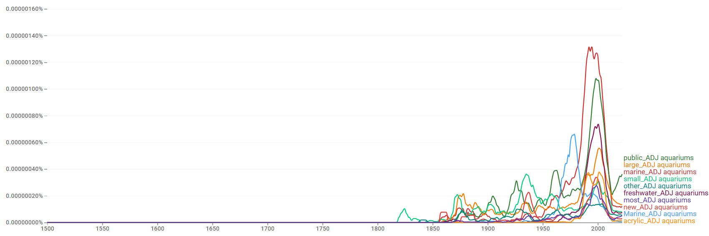
- **형용사 연어 — 고전형**  
  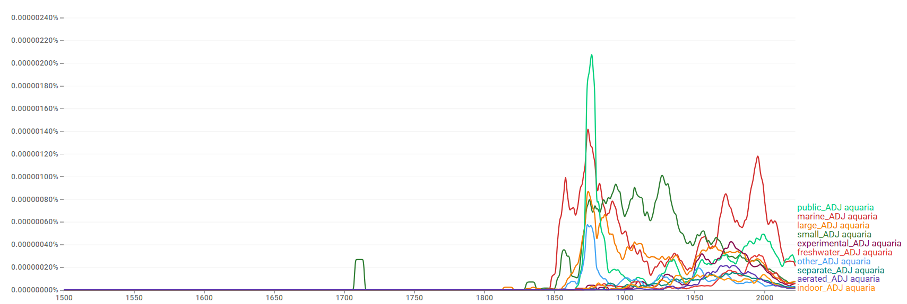
- **명사 연어 — 규칙형**  
  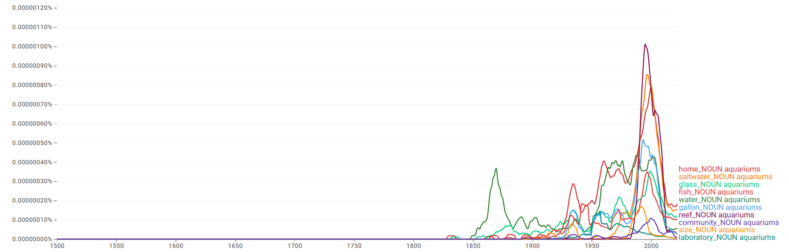
- **명사 연어 — 고전형**  
  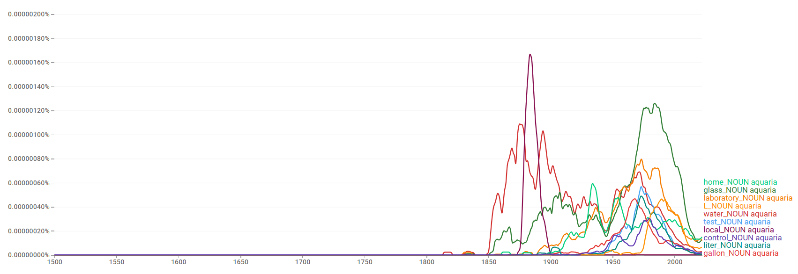

### COCA 맥락 분석

**규칙형:**

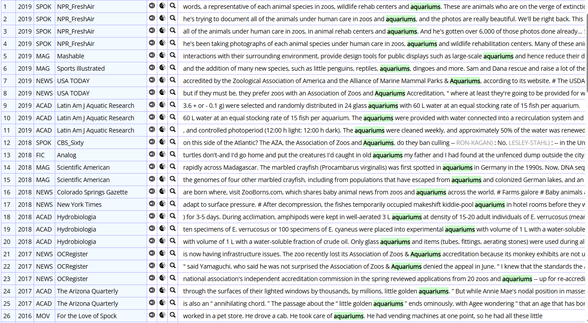

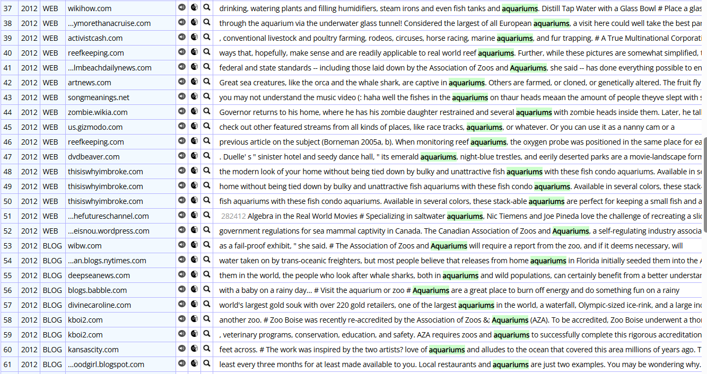

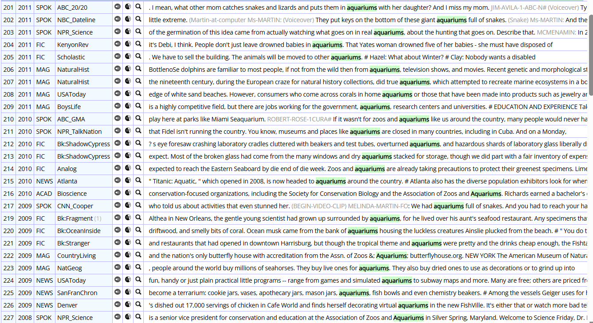

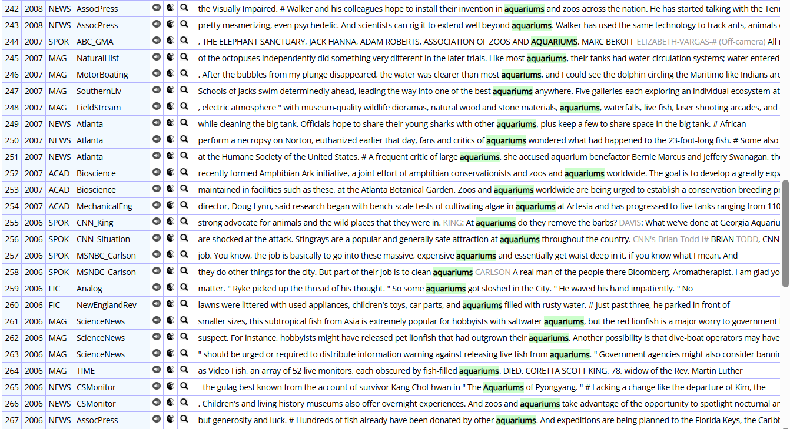

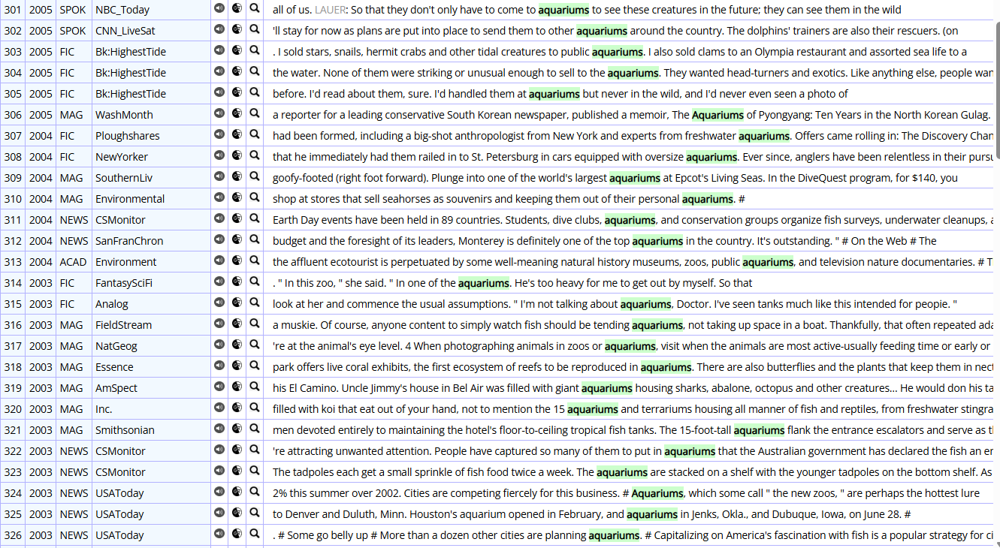

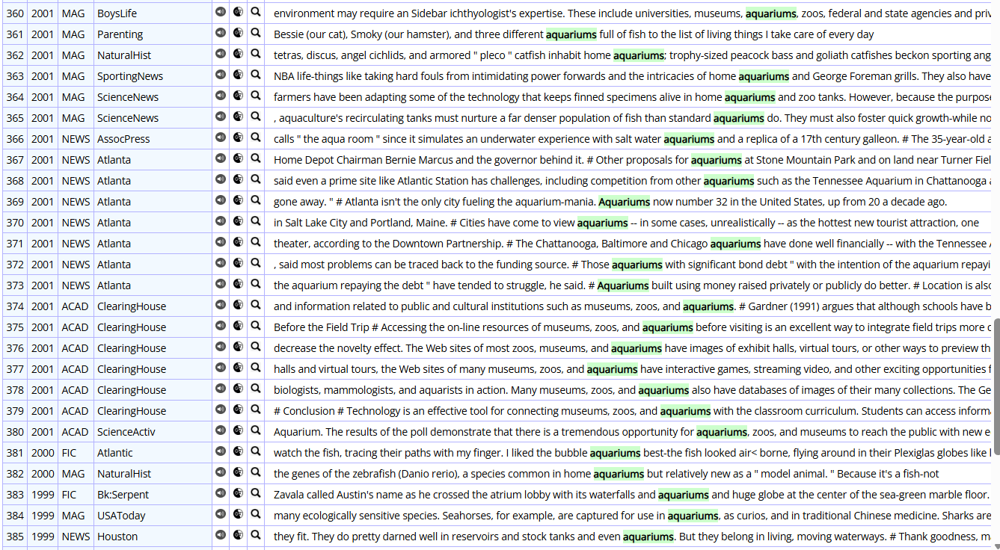

**고전형:**

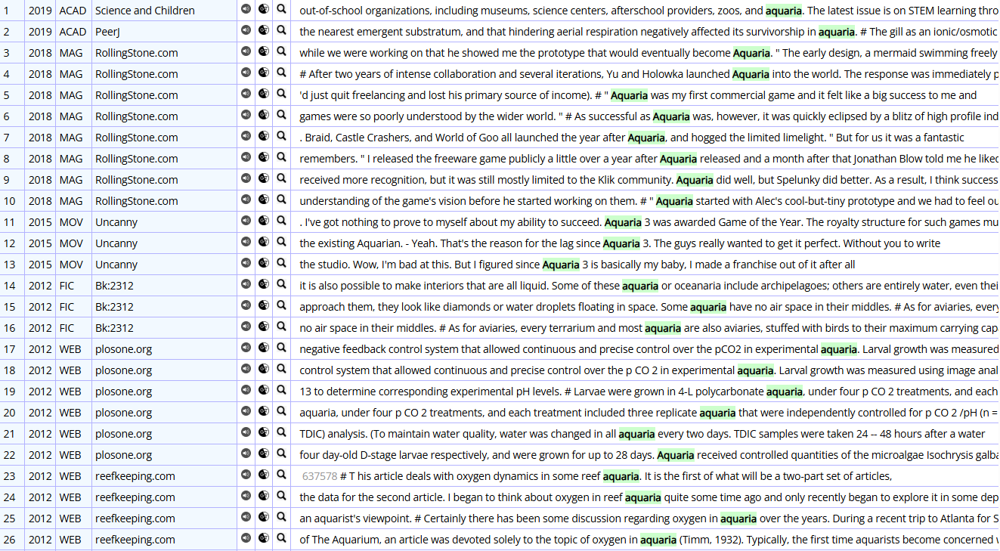

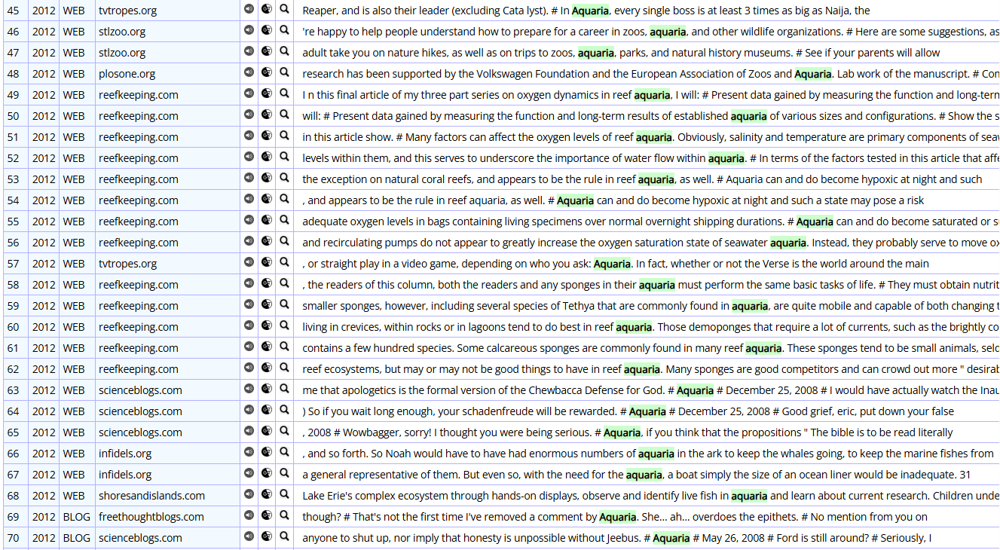

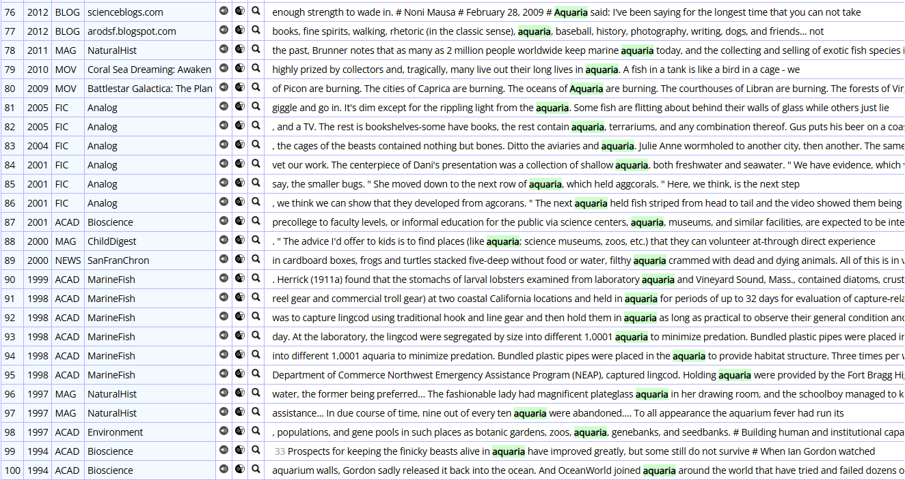

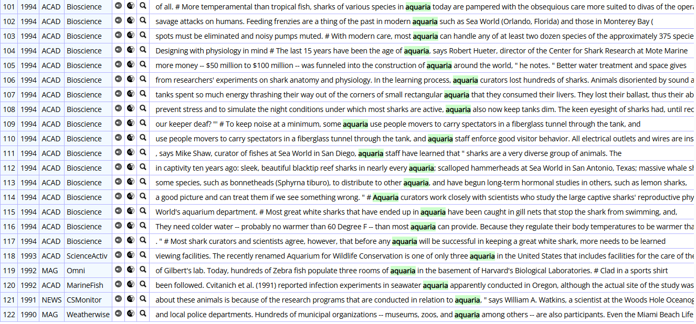

---

[← 전체 사례 목록으로](../README.md#사례-분석) · [방법론](../docs/methodology.md) · [결론 및 제언](../docs/conclusion.md)
