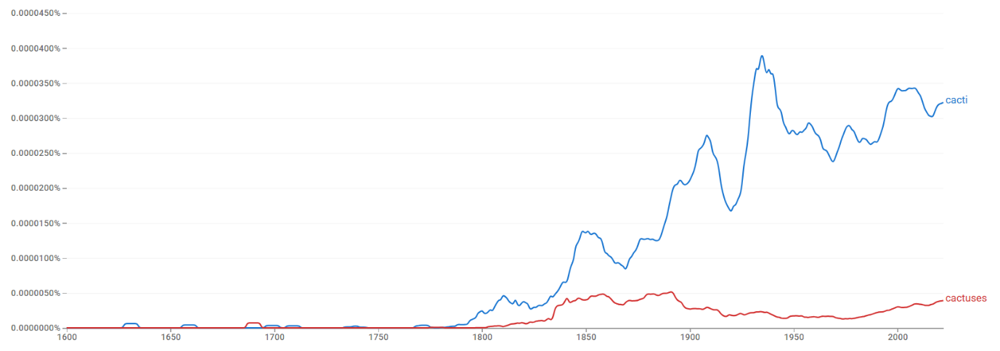
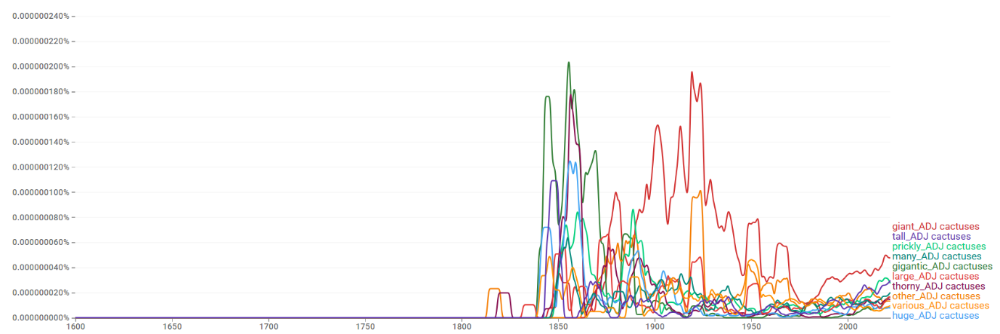
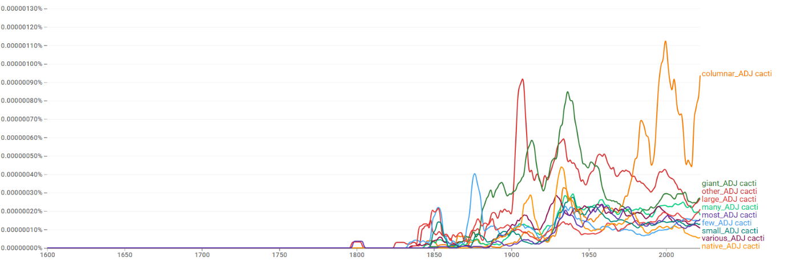
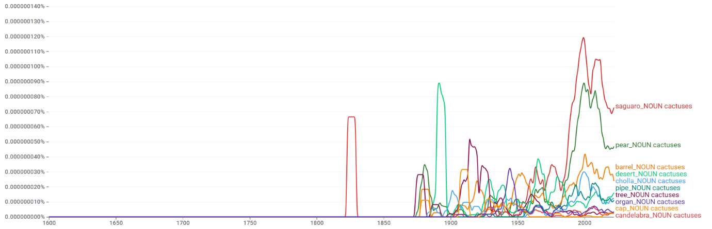
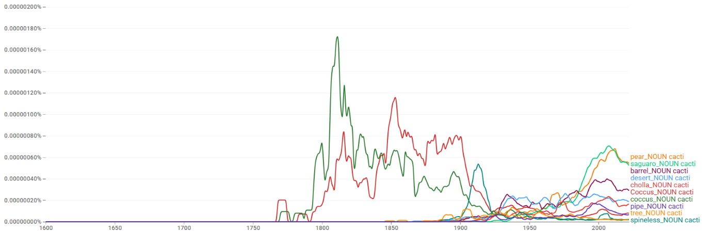
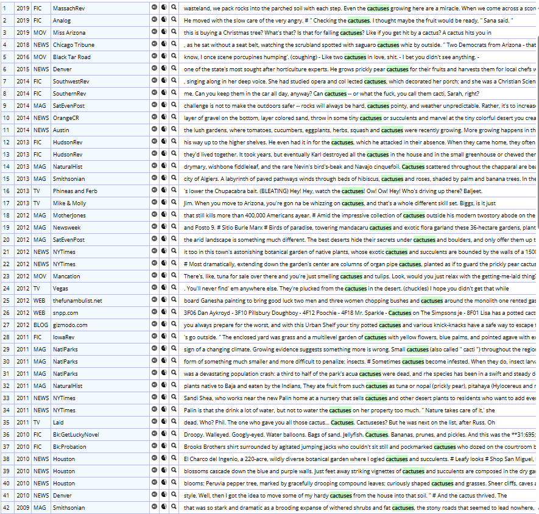
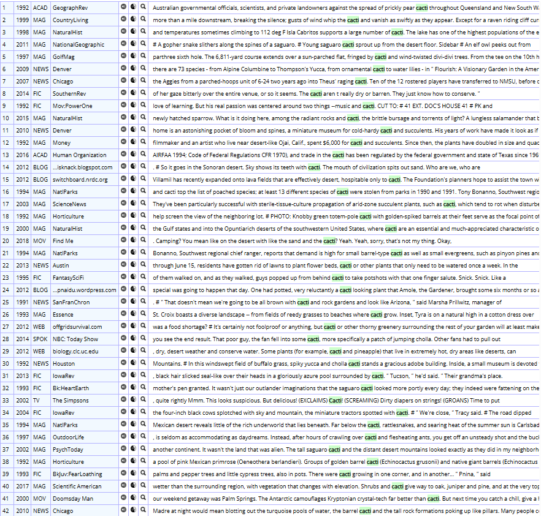

# cacti / cactuses

> **그룹**: 고전형 우세 그룹  
> **3층위 요약**: 1차 `고전형 우세` → 2차 `장기 고전형 우세 유지` → 3차 `경쟁`

*대표 이미지: cacti / cactuses Google Ngram 장기 사용량. 형용사·명사 연어 그래프와 COCA 맥락 캡처 등 나머지 이미지는 아래 [참조 이미지](#참조-이미지)에 정리했다.*

## 1. 결론

*cacti*와 *cactuses*는 ‘선인장’이라는 동일 의미를 공유하지만 비대칭을 보인다. 고전형 *cacti*가 전반적으로 우세를 유지하고 규칙형 *cactuses*는 제한적으로 잔존한다. *cacti*는 식물학적 종 분류·생태 서술·환경 보호·조경·원예 등 전문적·기술적 맥락에서, *cactuses*는 대중 매체·구어·개인 원예·관광/지역 정보 등 일상적 맥락에서 더 자주 나타난다. 다만 둘 사이의 뚜렷한 의미·register 분화는 발견하기 어렵고 규칙형이 제한적으로 존재하므로 **고전형 우세 → 장기 고전형 우세 유지 → 경쟁**의 구조다.

## 2. 연구 결과

| 층위 | 분석 축 | 결과 |
| --- | --- | --- |
| 1차 | 현재 사용 상태 | 고전형 우세 |
| 2차 | 변화의 속도·방향 | 장기 고전형 우세 유지 |
| 3차 | 작동 메커니즘 | 경쟁 |

## 3. 과정 및 결론 도달 과정 (사용 도구)

1차 **Ngram 사용량 그래프**로 고전형의 우위를, 2차 같은 그래프로 **장기 고전형 우세 유지**를 확인했다. 3차는 **Ngram 연어**(공통 연어가 다수, 근소한 차이)와 **COCA 맥락 분석**(자연생태·종 분류·법적 보호 vs 대중 매체·개인 원예·문학·관광)으로, 분명한 분화 없이 경쟁하는 양상을 해석했다.

## 4. 세부 정보 (구간 별 분절)

### 4-1. 1차 — 현재 사용 상태 (Google Ngram 사용량)

초기에는 두 형태 모두 매우 낮지만, 19세기 후반 이후 고전형 *cacti*가 점차 증가하여 20세기 전반·중반에 걸쳐 높은 사용량을 유지한다. 규칙형 *cactuses*는 점진적으로 증가하나 전 시기에 걸쳐 *cacti*보다 훨씬 낮은 수준에 머문다. 현재 *cacti*가 뚜렷한 우위를 점한다.

### 4-2. 2차 — 변화의 속도·방향

이른 시기부터 *cacti*가 중심을 확보한 뒤 그 우위를 지속적으로 유지하고 *cactuses*가 주변적으로 잔존한 **장기 고전형 우세 유지**의 경로다.

### 4-3. 3차 — 작동 메커니즘 (연어 + COCA)

두 형태 모두 *giant, large, other* 및 *saguaro, pear, barrel, desert, cholla* 등 공통 연어가 상위를 차지해 의미·분야 차이가 두드러지지 않는다. 다만 *cacti*는 *coccus cacti, tree cacti* 등 명칭 중심의 학술적 결합이 일부 보이고, *cactuses*는 외관 묘사·대중적/지역적 명칭에 가깝다. COCA에서도 *cacti*는 자연생태·종 분류·환경 보호·조경에, *cactuses*는 대중 매체·구어·개인 원예·문학·관광에 분포한다. 분명한 분화 없이 고전형이 중심을 유지하며 규칙형이 제한적으로 존재하는 **경쟁** 사례다.

### 4-4. 역사적 제언

*cacti*는 식물학이 라틴어 복수형을 학술 표준으로 고착시키면서 권위 있는 형태로 유지되었고, 규칙형 *cactuses*는 일상 화자들 사이에서 보다 직관적인 형태로 제한적으로 잔존한다. (식물학 표준화 1753 → 사막 식물 연구·보호의 제도화 1933·1975 → 학술·공식 용어로 유지)

## 참조 이미지

본문에는 대표 이미지(Ngram 사용량) 1개만 두고, 아래 연어 그래프 및 COCA 맥락 캡처는 참조로 분리한다.

### Google Ngram 연어 분석

- **형용사 연어 — 규칙형**  
  
- **형용사 연어 — 고전형**  
  
- **명사 연어 — 규칙형**  
  
- **명사 연어 — 고전형**  
  

### COCA 맥락 분석

**규칙형:**

**고전형:**

---

[← 전체 사례 목록으로](../README.md#사례-분석) · [방법론](../docs/methodology.md) · [결론 및 제언](../docs/conclusion.md)
