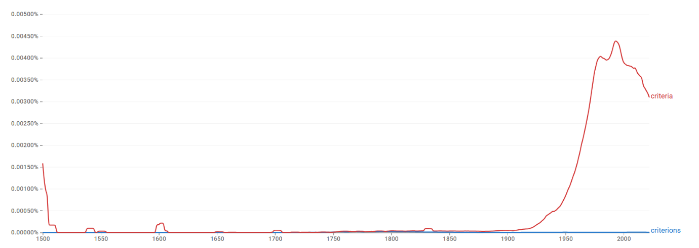
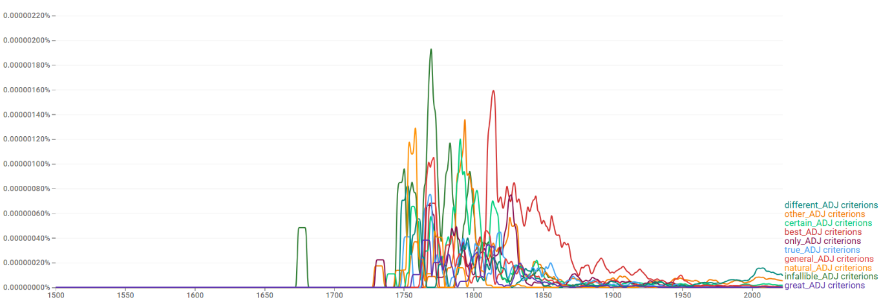
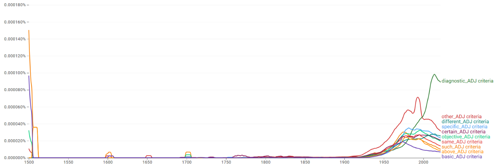
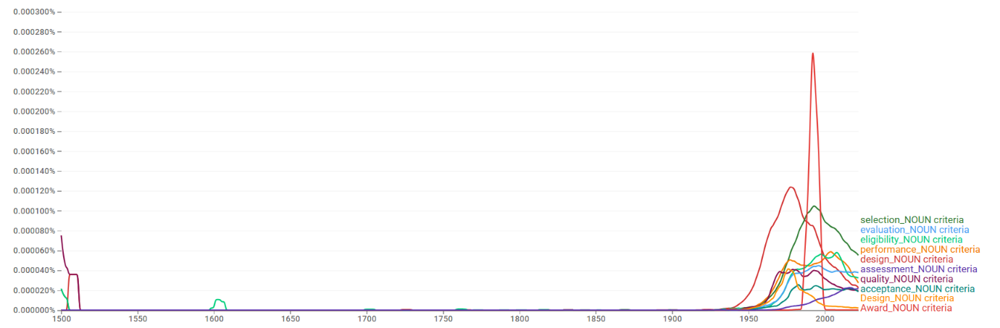
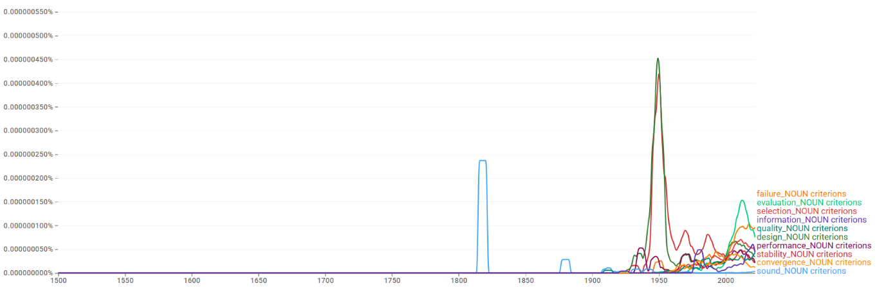
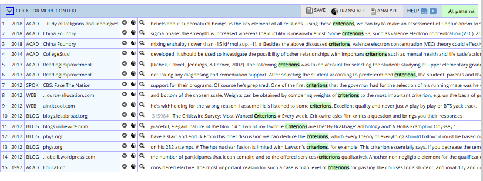
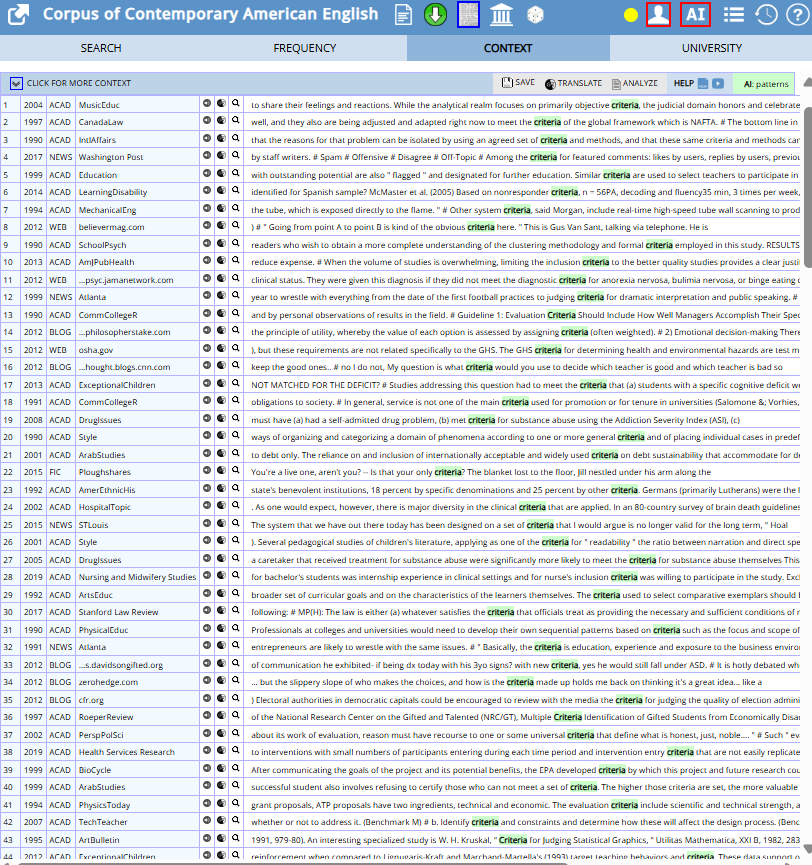
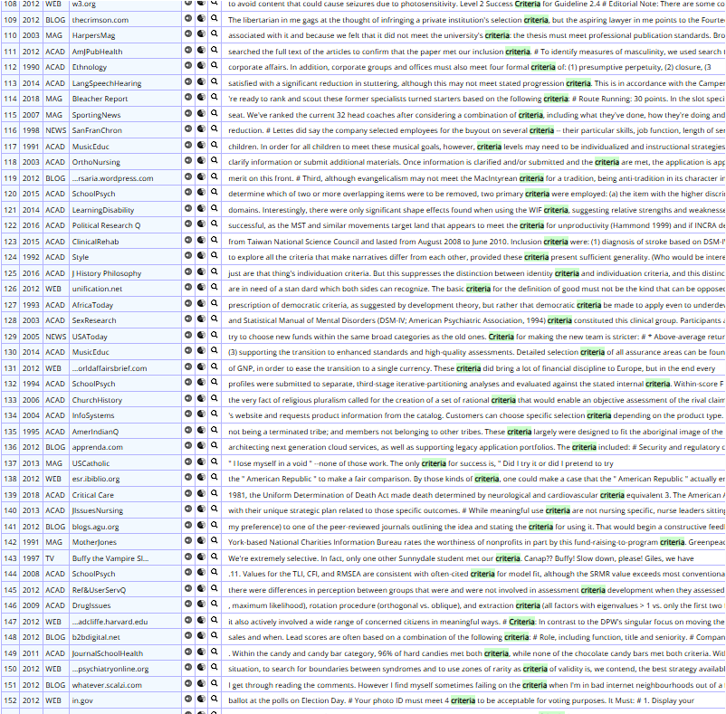

# criteria / criterions

> **그룹**: 고전형 우세 그룹  
> **3층위 요약**: 1차 `고전형 우세` → 2차 `빠른 수렴` → 3차 `경쟁`

*대표 이미지: criteria / criterions Google Ngram 장기 사용량. 형용사·명사 연어 그래프와 COCA 맥락 캡처 등 나머지 이미지는 아래 [참조 이미지](#참조-이미지)에 정리했다.*

## 1. 결론

*criteria*와 *criterions*는 ‘기준’이라는 동일 의미를 공유하지만 뚜렷한 비대칭을 보인다. *criteria*는 학술·의학·행정·평가 담화의 중심 형태로 자리 잡아 사실상 표준 복수형으로 기능하는 반면, *criterions*는 제한적·주변적 변이형으로만 남는다. 두 형태의 명확한 사용 분화를 정의하기는 어렵고, 고전형이 중심이 되고 규칙형이 주변 변이형으로 존재하는 양상이므로 **고전형 우세 → 빠른 수렴 → 경쟁**의 구조다.

## 2. 연구 결과

| 층위 | 분석 축 | 결과 |
| --- | --- | --- |
| 1차 | 현재 사용 상태 | 고전형 우세 |
| 2차 | 변화의 속도·방향 | 빠른 수렴 |
| 3차 | 작동 메커니즘 | 경쟁 |

## 3. 과정 및 결론 도달 과정 (사용 도구)

1차 **Ngram 사용량 그래프**로 고전형의 압도적 우위와 규칙형의 비가시성을, 2차 같은 그래프로 1950년대 이후의 **빠른 수렴**을 확인했다. 3차는 **Ngram 연어**(diagnosis 등 의학 결합의 부상)와 **COCA 맥락 분석**(진단·공적 규정·평가·철학)으로 두 형태가 분명한 의미 분화 없이 경쟁하되 고전형이 표준화된 양상을 해석했다.

## 4. 세부 정보 (구간 별 분절)

### 4-1. 1차 — 현재 사용 상태 (Google Ngram 사용량)

초기에는 두 형태 모두 매우 낮지만, 20세기 중반(특히 1950년대) 이후 고전형 *criteria*가 가파르게 상승해 20세기 후반 정점에 도달한 뒤에도 높은 수준을 유지한다. 규칙형 *criterions*는 전 시기에 걸쳐 거의 바닥 수준에 머문다. 현재 *criteria*가 압도적 우위를 점한다.

### 4-2. 2차 — 변화의 속도·방향

비교적 이른 시기부터 *criteria*가 중심을 확보한 뒤 그 우위를 급격히 강화한 **빠른 수렴(고전형 우세 속)**의 경로다.

### 4-3. 3차 — 작동 메커니즘 (연어 + COCA)

두 형태 모두 *other, different, certain* 등 일반·추상 연어가 상위에 나타나 사용 분야 차이가 크지 않다. 다만 *criteria*는 *diagnostic/selection/eligibility/performance criteria*처럼 의학·행정·평가 등 제도·전문 담화에서 안정적으로 쓰이고, *diagnosis* 연어가 21세기 들어 두드러지게 상승한다. COCA에서도 *criteria*는 전문 진단·공적 규정·평가 체계·철학적 정의에 폭넓게 쓰이는 반면, *criterions*는 개별 기준의 나열·특수 목적의 구체적 조건이라는 제한된 맥락에 한정된다. 뚜렷한 의미 분화 없이 고전형이 표준화된 **경쟁** 사례다.

### 4-4. 역사적 제언

*criteria*는 여러 조건을 묶은 체계적 기준의 집합을 가리키는 의미로 굳어지면서 고전형이 사실상의 표준으로 자리 잡았고, 규칙형 *criterions*는 주변적 변이형에 머물렀다.

## 참조 이미지

본문에는 대표 이미지(Ngram 사용량) 1개만 두고, 아래 연어 그래프 및 COCA 맥락 캡처는 참조로 분리한다.

### Google Ngram 연어 분석

- **형용사 연어 — 규칙형**  
  
- **형용사 연어 — 고전형**  
  
- **명사 연어 — 규칙형**  
  
- **명사 연어 — 고전형**  
  

### COCA 맥락 분석

**규칙형:**

**고전형:**

---

[← 전체 사례 목록으로](../README.md#사례-분석) · [방법론](../docs/methodology.md) · [결론 및 제언](../docs/conclusion.md)
