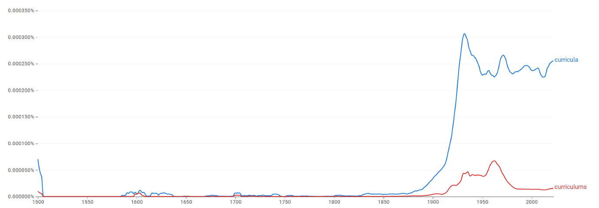
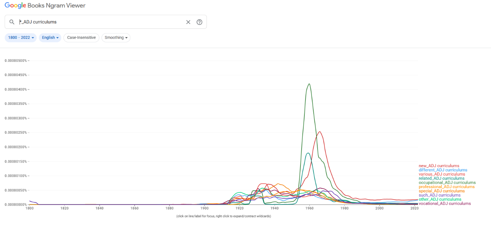
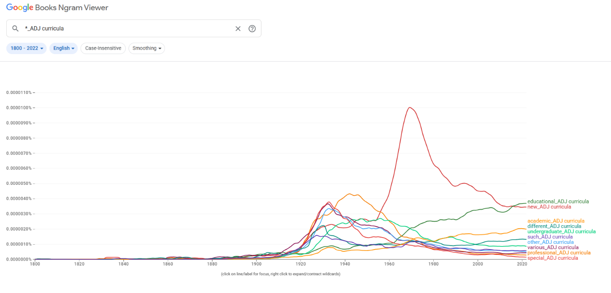
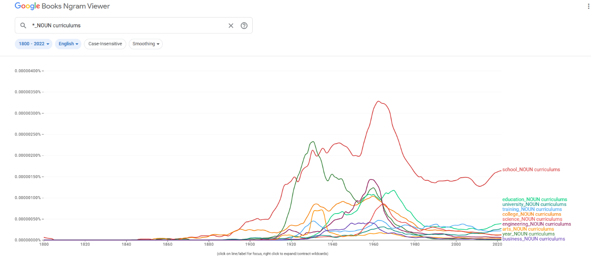
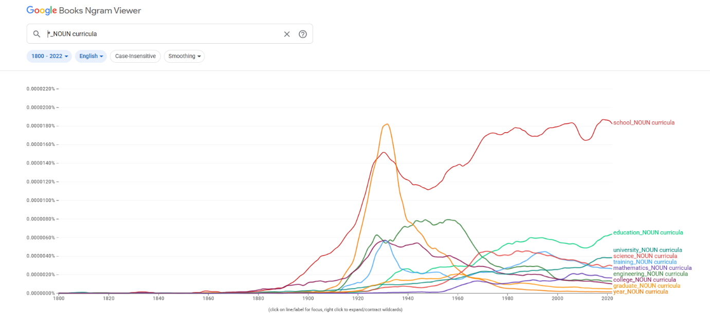
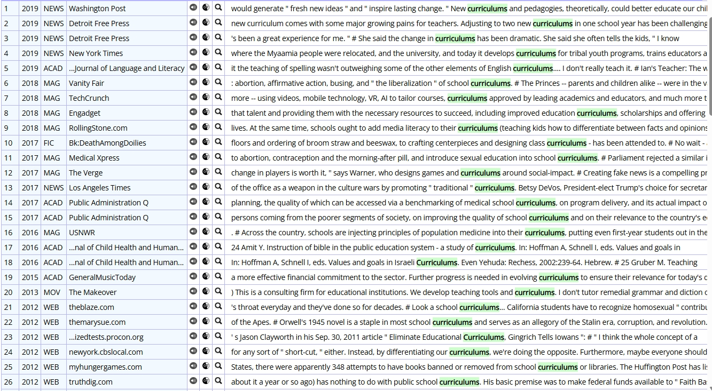
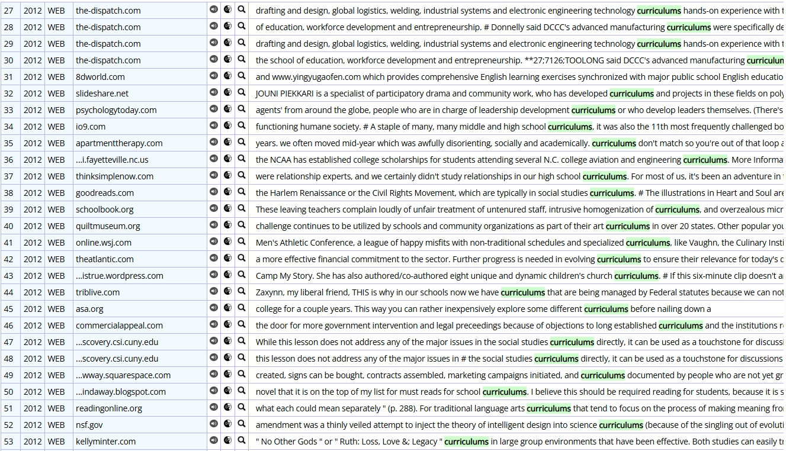
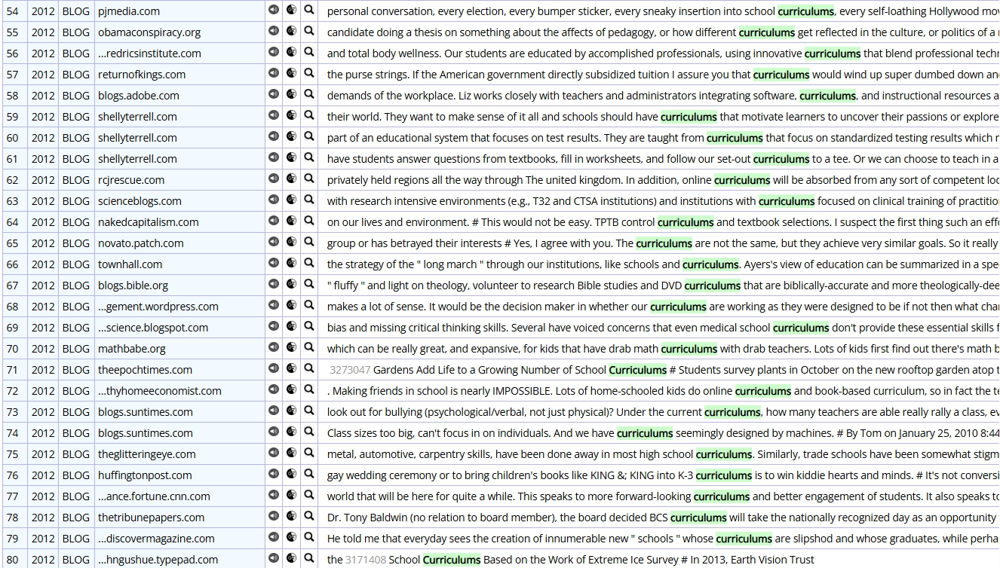
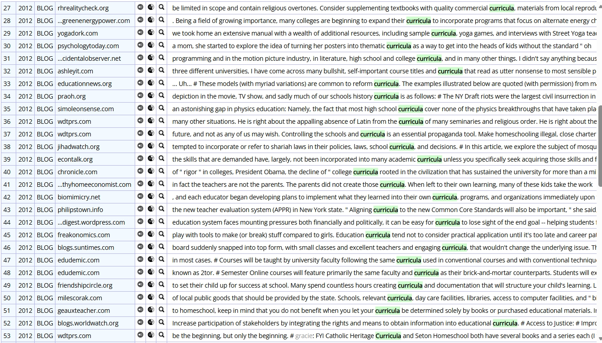
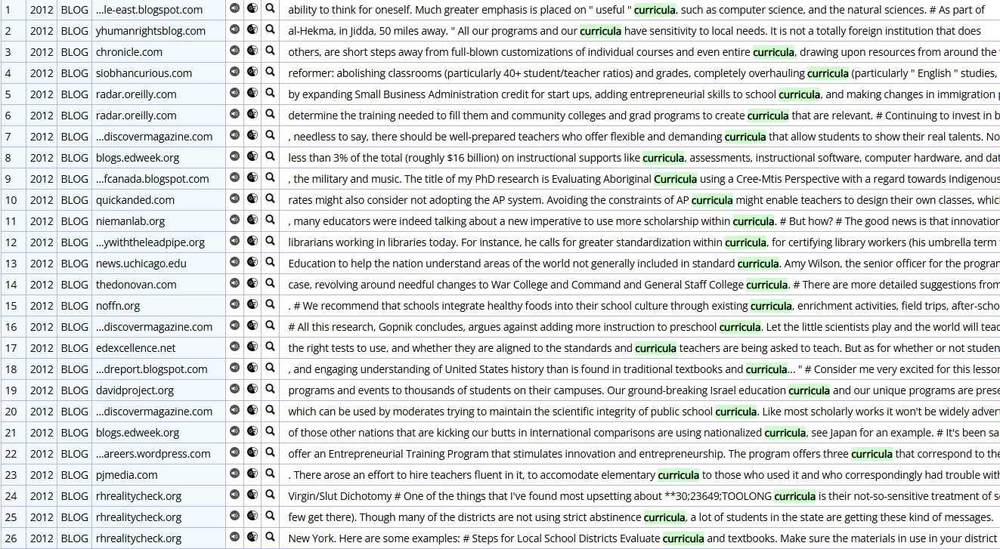

# curricula / curriculums

> **그룹**: 고전형 우세 그룹  
> **3층위 요약**: 1차 `고전형 우세` → 2차 `장기 고전형 우세 유지` → 3차 `register 분화`

*대표 이미지: curricula / curriculums Google Ngram 장기 사용량. 형용사·명사 연어 그래프와 COCA 맥락 캡처 등 나머지 이미지는 아래 [참조 이미지](#참조-이미지)에 정리했다.*

## 1. 결론

*curricula*와 *curriculums*는 ‘교육과정’이라는 동일 의미 영역을 공유하면서도 서로 다른 레지스터에 배분된다. *curricula*는 학술적·제도적 담화의 중심 형태로 자리 잡고, *curriculums*는 보다 일반적·실용적 맥락에서 제한적으로 쓰이는 변이형으로 기능한다. 따라서 **고전형 우세 → 장기 고전형 우세 유지 → register 분화**의 구조다.

## 2. 연구 결과

| 층위 | 분석 축 | 결과 |
| --- | --- | --- |
| 1차 | 현재 사용 상태 | 고전형 우세 |
| 2차 | 변화의 속도·방향 | 장기 고전형 우세 유지 |
| 3차 | 작동 메커니즘 | register 분화 |

## 3. 과정 및 결론 도달 과정 (사용 도구)

1차 **Ngram 사용량 그래프**로 고전형의 우위와 규칙형의 제한적 잔존을, 2차 같은 그래프로 **장기 고전형 우세 유지**를 확인했다. 3차는 **Ngram 연어**(academic/undergraduate vs vocational/business)와 **COCA 맥락 분석**(학술·정책·전문 vs 뉴스·블로그·직업·상업 자료)으로 레지스터 차이를 해석했다.

## 4. 세부 정보 (구간 별 분절)

### 4-1. 1차 — 현재 사용 상태 (Google Ngram 사용량)

초기에는 두 형태 모두 낮지만, 20세기 초반 이후 고전형 *curricula*가 빠르게 증가(특히 1920~1940년대)해 이후에도 높은 수준을 유지한다. 규칙형 *curriculums*는 20세기 전반까지 제한적이며, 1960년대 전후 상승 후 다시 감소해 주변적으로 유지된다. 현재 *curricula*가 뚜렷한 우위를 점한다.

### 4-2. 2차 — 변화의 속도·방향

장기 대등 경쟁이 아니라, 이른 시기부터 *curricula*가 중심을 확보하고 그 우위를 유지하는 가운데 *curriculums*가 주변적으로 잔존한 **장기 고전형 우세 유지**의 경로다.

### 4-3. 3차 — 작동 메커니즘 (연어 + COCA)

*curricula*는 *academic, undergraduate, professional* 및 *university, science, engineering*과 결합해 고등교육·학술 제도와 강하게 연결되고, *curriculums*는 *different, various, vocational, occupational, business*와 결합해 일반적·실무적 프로그램 분류에 가깝다. COCA에서 *curricula*는 학술적 정의·공적 정책·전문 분야 교육·교육 철학에, *curriculums*는 대중 매체·웹/블로그·직업 교육·상업 자료·사회적 논쟁에 결부된다. 같은 의미 영역 안에서 고전형=공식·학술, 규칙형=일반·실용으로 갈리는 **register 분화**다.

### 4-4. 역사적 제언

*curricula*는 교육학과 대학 행정, 제도적 교육 담화의 중심 형태로 유지된 반면, 규칙형 *curriculums*는 공교육 현장과 실무 문서에서 보다 직관적인 형태로 제한적으로 사용되며, 두 형태가 서로 다른 레지스터에 배분되었다.

## 참조 이미지

본문에는 대표 이미지(Ngram 사용량) 1개만 두고, 아래 연어 그래프 및 COCA 맥락 캡처는 참조로 분리한다.

### Google Ngram 연어 분석

- **형용사 연어 — 규칙형**  
  
- **형용사 연어 — 고전형**  
  
- **명사 연어 — 규칙형**  
  
- **명사 연어 — 고전형**  
  

### COCA 맥락 분석

**규칙형:**

**고전형:**

---

[← 전체 사례 목록으로](../README.md#사례-분석) · [방법론](../docs/methodology.md) · [결론 및 제언](../docs/conclusion.md)
