# formulas / formulae

> **그룹**: 규칙형 우세 그룹  
> **3층위 요약**: 1차 `규칙형 우세` → 2차 `장기 규칙형 우세 유지` → 3차 `register 분화`

*대표 이미지: formulas / formulae Google Ngram 장기 사용량. 형용사·명사 연어 그래프와 COCA 맥락 캡처 등 나머지 이미지는 아래 [참조 이미지](#참조-이미지)에 정리했다.*

## 1. 결론

*formulas*와 *formulae*는 동일한 기본 의미 영역을 공유하지만, 규칙 복수형 *formulas*가 더 넓은 사용 기반을 확보한 채 서로 다른 레지스터로 점차 배분되는 사례다. *formulae*는 수학·과학·경제학·신학 등 전문적·학술적 맥락에서 제한적으로 유지되는 반면, *formulas*는 그 학술적 의미를 일정 부분 유지하면서도 분유·화장품·의약품 같은 상업 제품, 행정 기준, *formulas for success* 같은 비유적 표현까지 포괄하며 일상적·실용적 영역으로 확장된다. 따라서 이 사례는 **규칙형 우세 → 장기 규칙형 우세 유지 → register 분화**의 구조를 보인다.

## 2. 연구 결과

| 층위 | 분석 축 | 결과 |
| --- | --- | --- |
| 1차 | 현재 사용 상태 | 규칙형 우세 |
| 2차 | 변화의 속도·방향 | 장기 규칙형 우세 유지 |
| 3차 | 작동 메커니즘 | register 분화 |

## 3. 과정 및 결론 도달 과정 (사용 도구)

1차는 **Google Ngram 사용량 그래프**로 두 형태의 장기 사용량과 우세 형태를 파악했고, 2차는 같은 Ngram 그래프에서 우세 형성 경로(즉각 대체인지 장기 병행인지)를 읽었다. 3차는 **Google Ngram 형용사·명사 연어 그래프**와 **COCA 맥락 분석(매체·용례)**을 결합해 두 형태가 어느 의미 영역·레지스터에 배분되는지를 해석했다.

## 4. 세부 정보 (구간 별 분절)

### 4-1. 1차 — 현재 사용 상태 (Google Ngram 사용량)

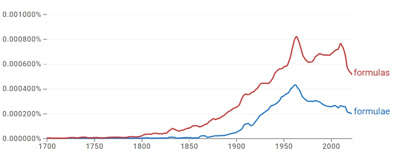

초기에는 두 형태 모두 사용량이 낮지만, 19세기 초 이후 *formulas*가 점차 증가하고 19세기 후반부터 상승세가 분명해진다. *formulae*는 19세기 후반 이후 본격 증가해 20세기 중반까지 확대되지만, 전 시기에 걸쳐 *formulas*가 더 높은 사용량을 유지한다. 현재는 규칙형 *formulas*가 뚜렷한 우위를 점한다.

### 4-2. 2차 — 변화의 속도·방향

한 형태가 다른 형태를 즉각 대체한 것이 아니라, 두 형태가 일정 기간 병행 사용되는 가운데 규칙형이 더 넓은 사용 기반을 지속적으로 확보하며 상대적 우위를 유지해 왔다. 즉 **규칙형 우세 → 장기 규칙형 우세 유지**의 경로다.

### 4-3. 3차 — 작동 메커니즘 (연어 + COCA)

형용사 연어에서는 *mathematical, structural, chemical, simple* 등 유사 연어를 공유해 한때 수학·과학 영역에서 병행 사용되었음이 확인된다. 그러나 명사 연어에서 *formulas*는 *infant/milk formulas*(상업 제품), *funding/allocation/benefit formulas*(행정·재무)로 확장되는 반면, *formulae*는 *quadrature/transformation/recurrence/interpolation formulae* 등 제한된 전문 맥락에 머문다. COCA에서도 *formulas*는 학술적 의미(*logical/mathematical formulas*)를 유지하면서 상업 제품·비유적 용법(*formulas for success*)까지 확장되는 반면, *formulae*는 수학·과학·경제학·신학 등 전문 담화에 한정된다. 따라서 두 형태는 **register 분화**로 설명된다.

### 4-4. 역사적 제언

고전형 *formulae*는 학술 담화가 라틴어 문법을 규범으로 삼던 전통 속에서 권위 있는 형태로 자리 잡았으나, 영어식 형태를 선호하는 실용적 언어 사용이 확산되면서 규칙형 *formulas*가 일반 표준으로 자리 잡았다.

## 참조 이미지

본문에는 대표 이미지(Ngram 사용량) 1개만 두고, 아래 연어 그래프 및 COCA 맥락 캡처는 참조로 분리한다.

### Google Ngram 연어 분석

- **형용사 연어 — 규칙형**  
  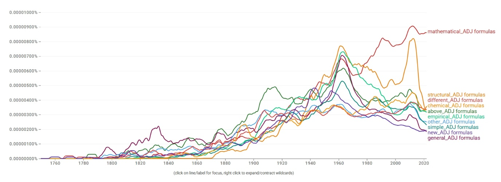
- **형용사 연어 — 고전형**  
  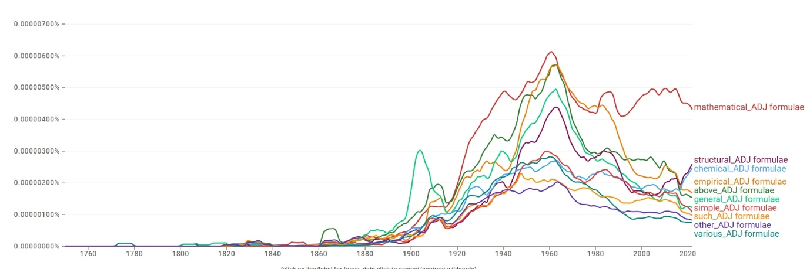
- **명사 연어 — 규칙형**  
  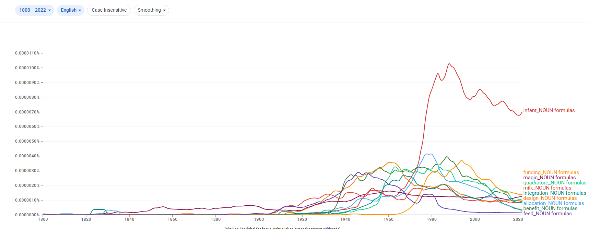
- **명사 연어 — 고전형**  
  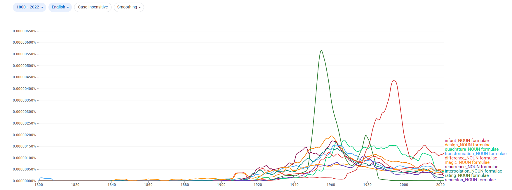

### COCA 맥락 분석

**규칙형:**

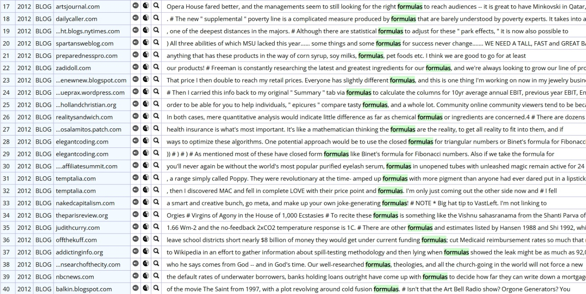

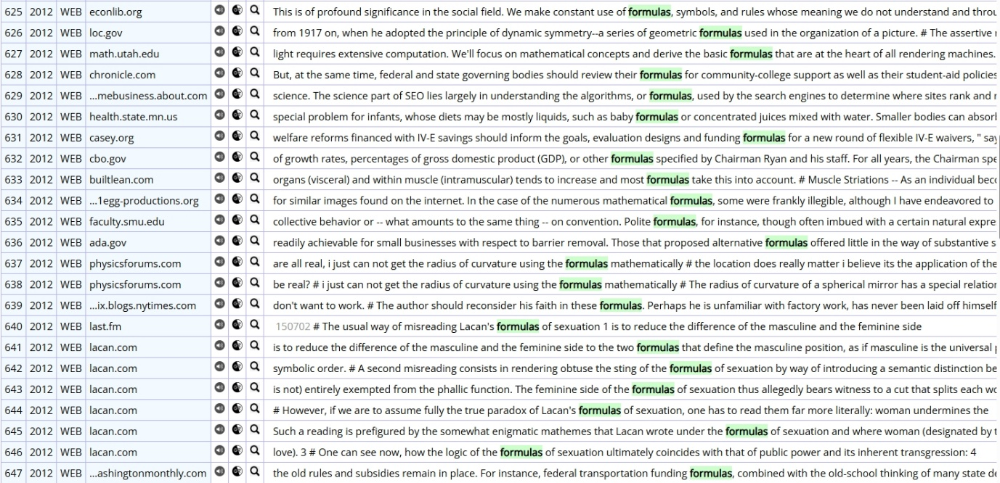

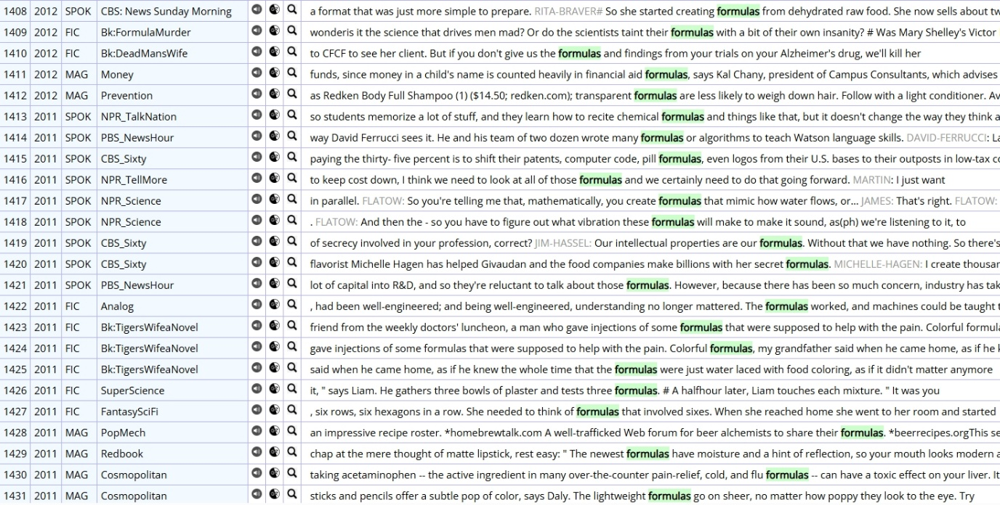

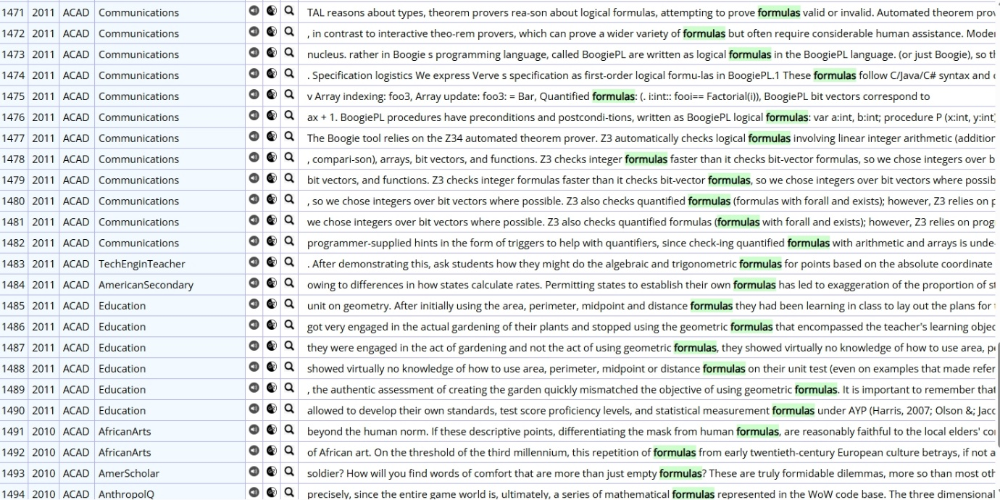

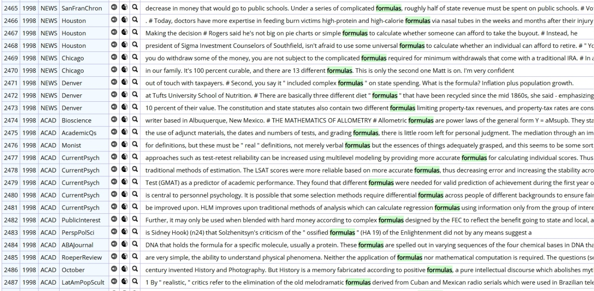

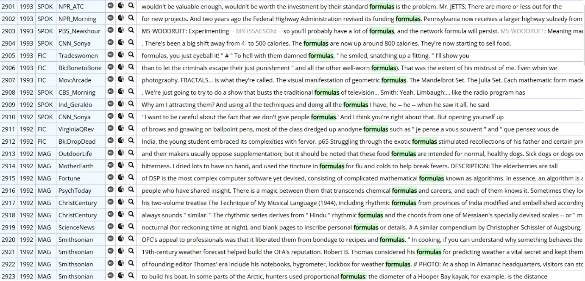

**고전형:**

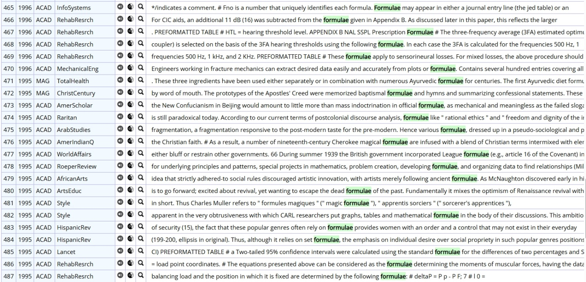

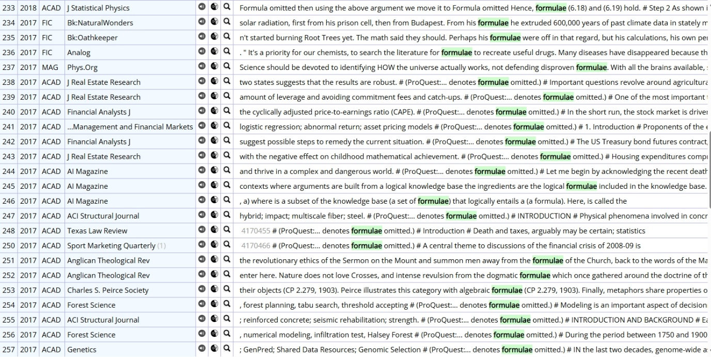

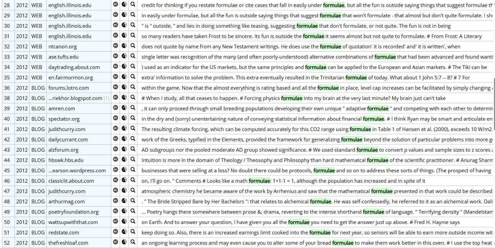

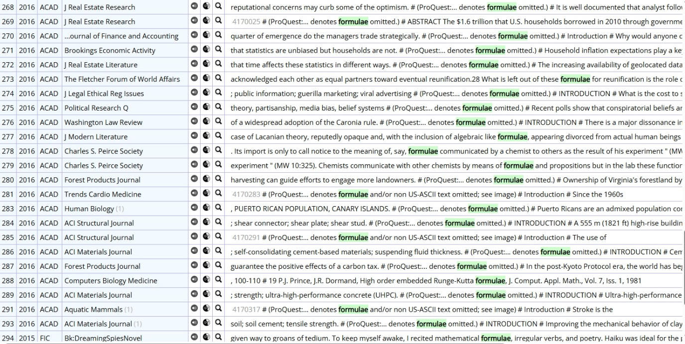

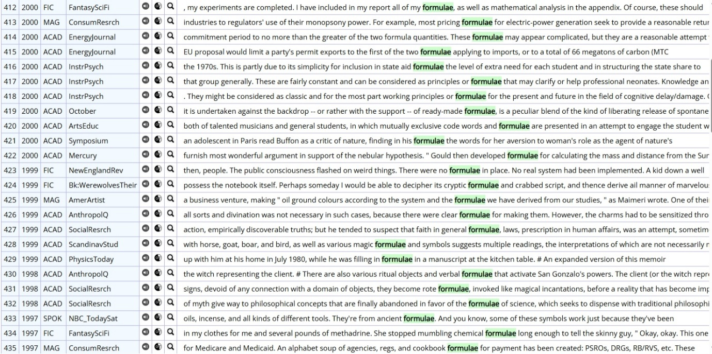

---

[← 전체 사례 목록으로](../README.md#사례-분석) · [방법론](../docs/methodology.md) · [결론 및 제언](../docs/conclusion.md)
