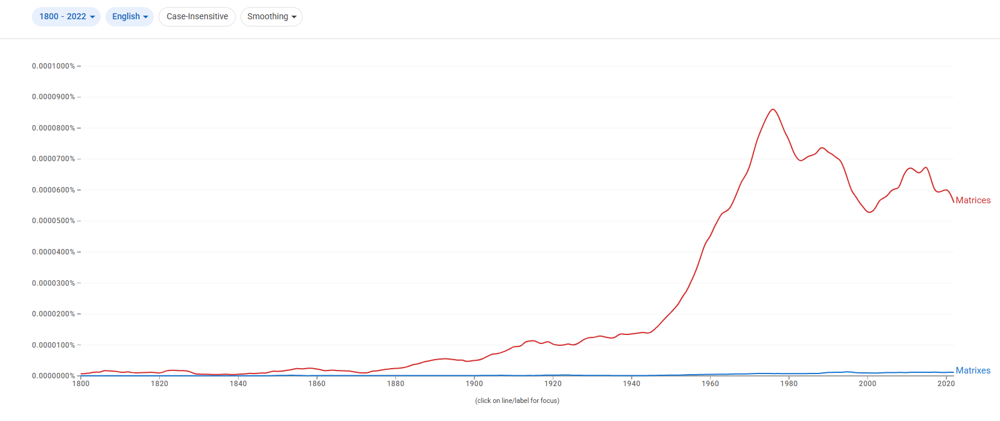
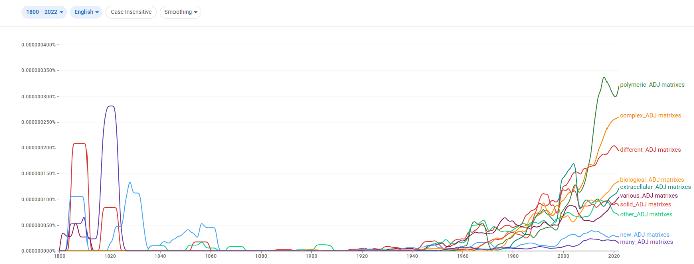
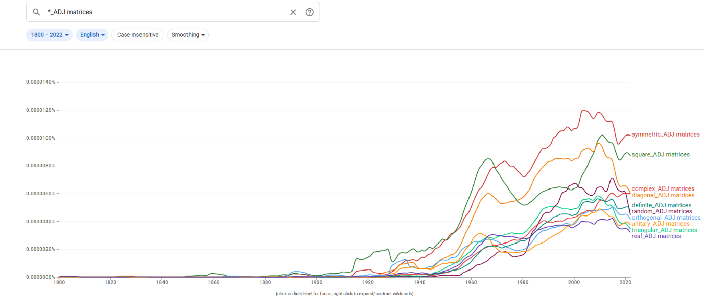
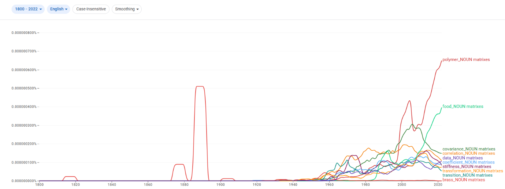
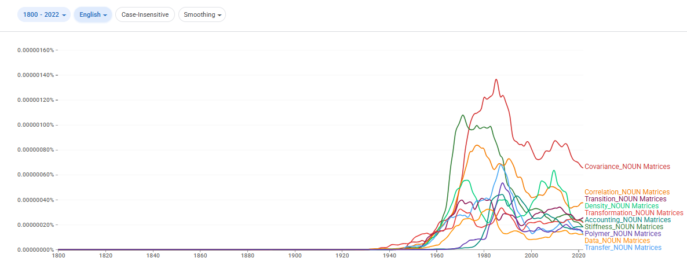
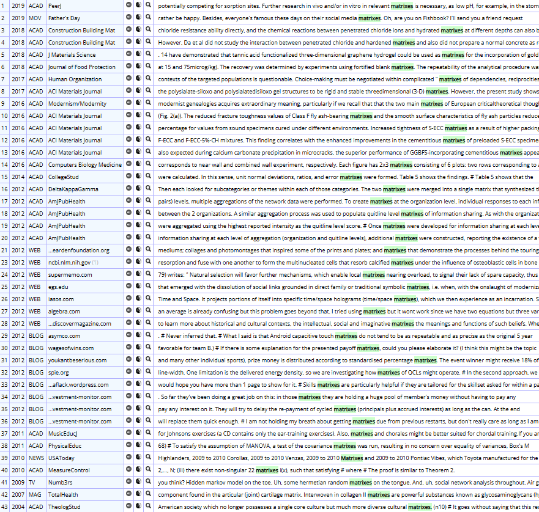
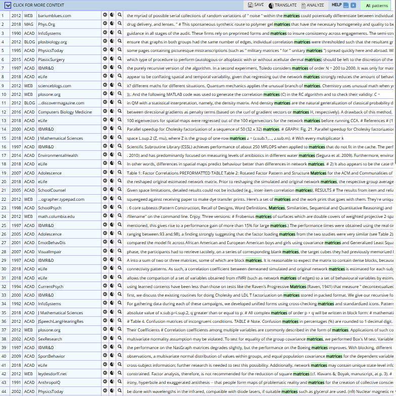

# matrices / matrixes

> **그룹**: 고전형 우세 그룹  
> **3층위 요약**: 1차 `고전형 우세` → 2차 `장기 고전형 우세 유지` → 3차 `register 분화`

*대표 이미지: matrices / matrixes Google Ngram 장기 사용량. 형용사·명사 연어 그래프와 COCA 맥락 캡처 등 나머지 이미지는 아래 [참조 이미지](#참조-이미지)에 정리했다.*

## 1. 결론

*matrices*와 *matrixes*는 ‘행렬/기질’이라는 동일 의미 영역을 공유하지만 서로 다른 레지스터에 배분된다. *matrices*는 수학·통계·물리·컴퓨터 과학의 학술적·전문적 표준형으로, *matrixes*는 일부 응용 과학(재료·생물) 및 비격식 맥락의 주변적 변이형으로 기능한다. 따라서 **고전형 우세 → 장기 고전형 우세 유지 → register 분화**의 구조다.

## 2. 연구 결과

| 층위 | 분석 축 | 결과 |
| --- | --- | --- |
| 1차 | 현재 사용 상태 | 고전형 우세 |
| 2차 | 변화의 속도·방향 | 장기 고전형 우세 유지 |
| 3차 | 작동 메커니즘 | register 분화 |

## 3. 과정 및 결론 도달 과정 (사용 도구)

1차 **Ngram 사용량 그래프**로 고전형의 압도적 우위를, 2차 같은 그래프로 **장기 고전형 우세 유지**를 확인했다. 3차는 **Ngram 연어**(symmetric/square/covariance vs polymer/food/biological)와 **COCA 맥락 분석**(수학·통계·데이터 과학 vs 재료·토목·인문학적 비유)으로 레지스터 분화를 해석했다.

## 4. 세부 정보 (구간 별 분절)

### 4-1. 1차 — 현재 사용 상태 (Google Ngram 사용량)

초기에는 두 형태 모두 낮지만, 19세기 후반 이후 고전형 *matrices*가 증가하고 20세기 중반(특히 1950년대) 이후 급증해 정점에 도달한 뒤에도 높은 수준을 유지한다. 규칙형 *matrixes*는 전 시기에 걸쳐 매우 낮고 제한적이다. 현재 *matrices*가 압도적으로 우세하다.

### 4-2. 2차 — 변화의 속도·방향

대등 경쟁이 아니라, 이른 시기부터 *matrices*가 중심을 확보한 뒤 그 우위를 지속적으로 강화하고 *matrixes*가 제한적으로 잔존한 **장기 고전형 우세 유지**의 경로다.

### 4-3. 3차 — 작동 메커니즘 (연어 + COCA)

*matrices*는 *symmetric/square/covariance/correlation/transition/transformation matrices* 등과 결합해 선형대수·통계·물리·계산과학의 핵심 기술어로 쓰이고, *matrixes*는 *polymeric/extracellular/biological*, *polymer/food matrixes* 등과 결합해 재료·생명과학의 물리적 ‘기질’을 지칭하는 응용 맥락에 가깝다. COCA에서도 *matrices*는 수학·통계 연산·데이터 과학·심리 검사(Raven's Progressive Matrices)에, *matrixes*는 재료·토목 공학·인문학적 비유·일부 데이터 맥락에 분포한다. 같은 의미 영역에서 고전형=학술 표준, 규칙형=응용·비격식으로 갈리는 **register 분화**다.

### 4-4. 역사적 제언

고전형 *matrices*는 *matrix*가 수학 전문 용어로 자리 잡는 과정에서 라틴어 복수형으로 규범화되었고, 이후 수학·통계·컴퓨터 과학의 학술 표준 용어로 고착되며 형태가 유지되었다. 규칙형 *matrixes*는 일부 응용적 맥락에만 주변적으로 남았다.

## 참조 이미지

본문에는 대표 이미지(Ngram 사용량) 1개만 두고, 아래 연어 그래프 및 COCA 맥락 캡처는 참조로 분리한다.

### Google Ngram 연어 분석

- **형용사 연어 — 규칙형**  
  
- **형용사 연어 — 고전형**  
  
- **명사 연어 — 규칙형**  
  
- **명사 연어 — 고전형**  
  

### COCA 맥락 분석

**규칙형:**

**고전형:**

---

[← 전체 사례 목록으로](../README.md#사례-분석) · [방법론](../docs/methodology.md) · [결론 및 제언](../docs/conclusion.md)
