# premia / premiums

> **그룹**: 고전형 우세 그룹  
> **3층위 요약**: 1차 `고전형 우세` → 2차 `빠른 수렴` → 3차 `register 분화`

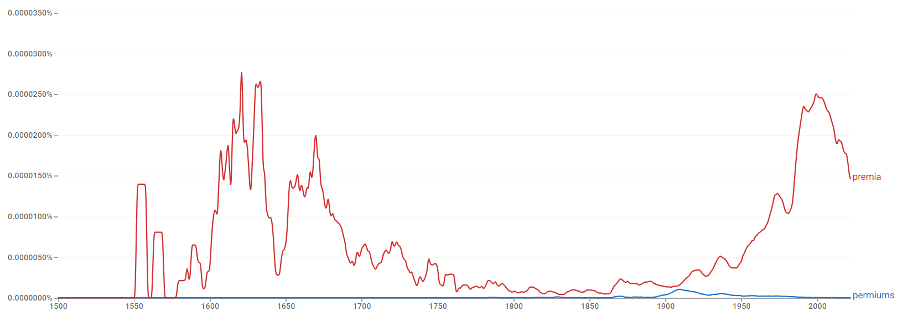

*대표 이미지: premia / premiums Google Ngram 장기 사용량. 형용사·명사 연어 그래프와 COCA 맥락 캡처 등 나머지 이미지는 아래 [참조 이미지](#참조-이미지)에 정리했다.*

## 1. 결론

*premia*와 *premiums*는 ‘기본 가격·보상에 덧붙는 추가 금액’이라는 동일 의미 영역을 공유하지만 기능이 분화된다. *premia*는 위험 보상·자산가격·거시금융을 설명하는 추상적·이론적 전문 용어(*risk/term/sovereign premia*)로 유지되고, *premiums*는 건강보험·Medicare·책임보험·계약·회계 실무의 구체적 지급 항목으로 기능한다. Ngram상 고전형이 장기적으로 더 강한 존재감을 보이므로, **고전형 우세 → 빠른 수렴 → register 분화**의 구조다.

## 2. 연구 결과

| 층위 | 분석 축 | 결과 |
| --- | --- | --- |
| 1차 | 현재 사용 상태 | 고전형 우세 |
| 2차 | 변화의 속도·방향 | 빠른 수렴 |
| 3차 | 작동 메커니즘 | register 분화 |

## 3. 과정 및 결론 도달 과정 (사용 도구)

1차 **Ngram 사용량 그래프**로 고전형의 장기 우세(현대 금융 담화에서의 재강화 포함)를, 2차 같은 그래프로 규칙형이 실질적으로 대체하지 못한 **빠른 수렴** 경로를 읽었다. 3차는 **Ngram 연어**(risk/term/liquidity vs insurance/unearned/renewal)와 **COCA 맥락 분석**(금융경제학·거시정책 vs 건강보험·계약 실무)으로 레지스터 분화를 해석했다.

## 4. 세부 정보 (구간 별 분절)

### 4-1. 1차 — 현재 사용 상태 (Google Ngram 사용량)

초기에는 규칙형 *premiums*가 거의 가시적이지 않은 반면, 고전형 *premia*는 16세기 중반~17세기 후반에 높은 사용량으로 우세하다. *premia*는 18세기 이후 감소했다가 20세기 중반 이후 다시 상승해 20세기 후반·21세기 초반에 더 뚜렷한 존재감을 보인다. 현재는 규칙형이 아니라 고전형 *premia*가 뚜렷한 우위를 점한다.

### 4-2. 2차 — 변화의 속도·방향

장기 경쟁이 아니라, 초기부터 *premia*가 중심을 차지했고 사용량 부침이 있었더라도 규칙형이 이를 실질적으로 대체하지 못한 채 고전형이 우세를 유지한 **빠른 수렴**의 경로다.

### 4-3. 3차 — 작동 메커니즘 (연어 + COCA)

*premia*는 *forward/higher/future/risk/term/liquidity/market* 및 *wage/skill/overtime premia*와 결합해 금융경제학의 추상적·계량적 개념과 연결되고, *premiums*는 *unearned/gross/deferred/insurance/net/renewal*과 결합해 보험·회계·계약 실무의 지급 항목을 가리킨다. COCA에서 *premiums*는 건강보험·Medicare·책임보험·계약/회계·노동시장 수당의 실용적 제도어로, *premia*는 위험 보상·자산가격·국가채무·환율·CDS의 이론적 전문어로 분포한다. 같은 경제 의미 영역에서 고전형=학술·이론, 규칙형=실무·제도로 갈리는 **register 분화**다.

### 4-4. 역사적 제언

*premia*는 라틴어 기반 문어 전통이 강하던 시기에 우세했으나 그 전통이 약해지며 쇠퇴했고, 이후 금융경제학에서 위험·수익 구조를 가리키는 전문 용어로 재부상했다. 반면 *premiums*는 보험·계약·실무 영역의 표준 형태로 굳어져, 두 형태가 분야에 따라 기능을 분담한다.

## 참조 이미지

본문에는 대표 이미지(Ngram 사용량) 1개만 두고, 아래 연어 그래프 및 COCA 맥락 캡처는 참조로 분리한다.

### Google Ngram 연어 분석

- **형용사 연어 — 규칙형**  
  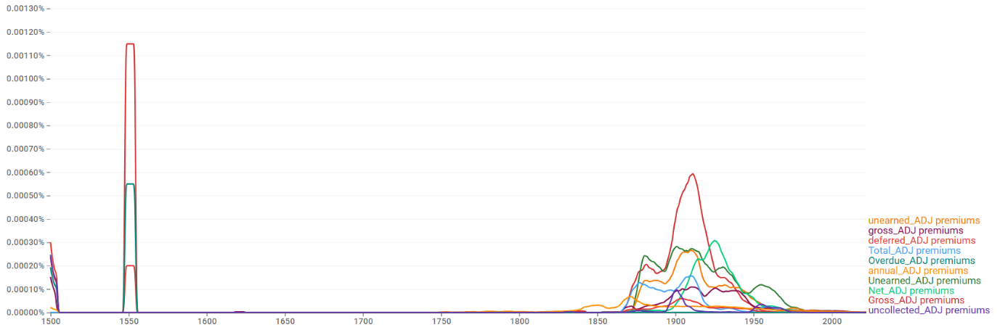
- **형용사 연어 — 고전형**  
  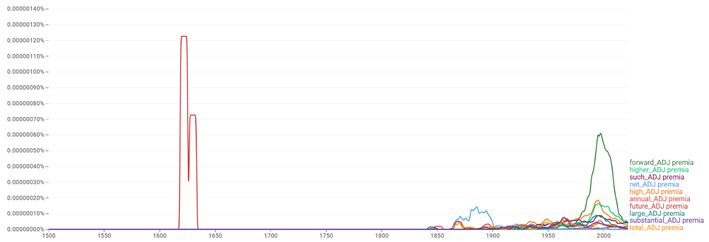
- **명사 연어 — 규칙형**  
  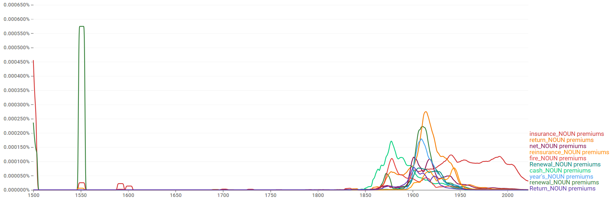
- **명사 연어 — 고전형**  
  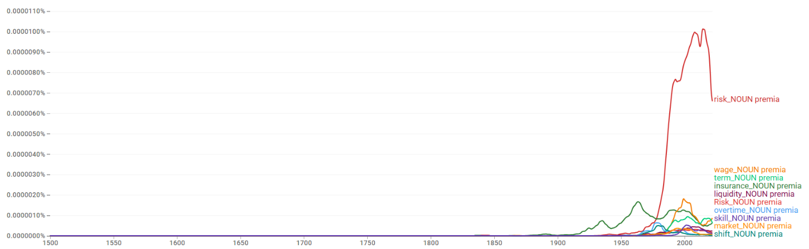

### COCA 맥락 분석

**규칙형:**

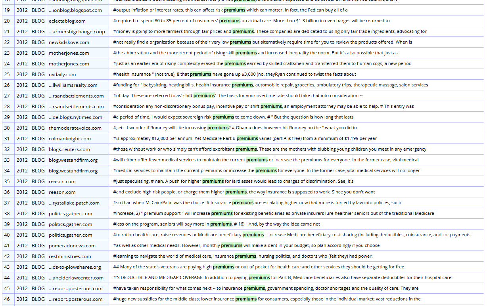

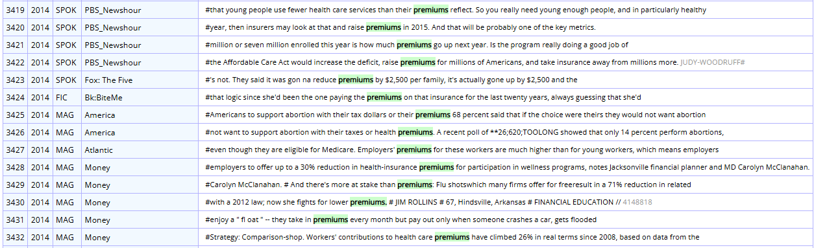

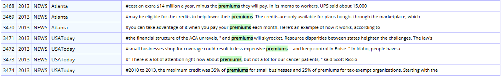

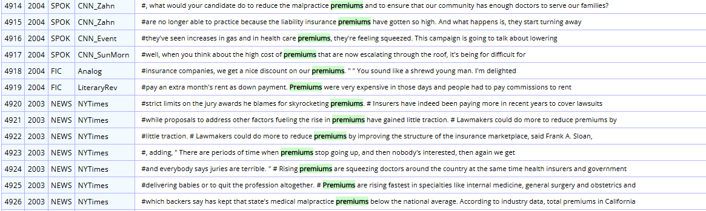

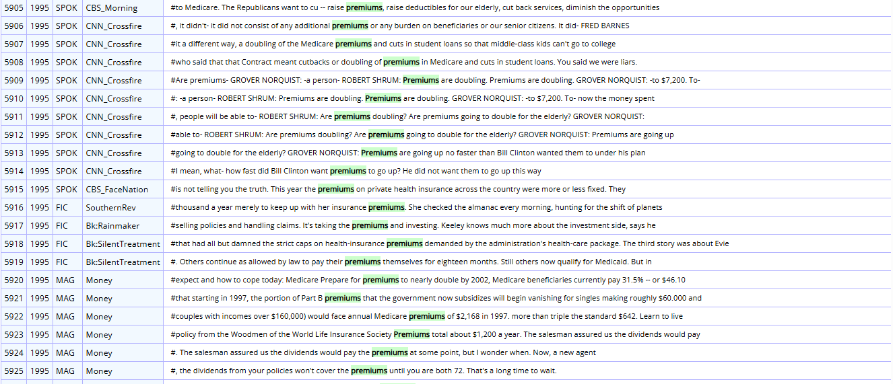

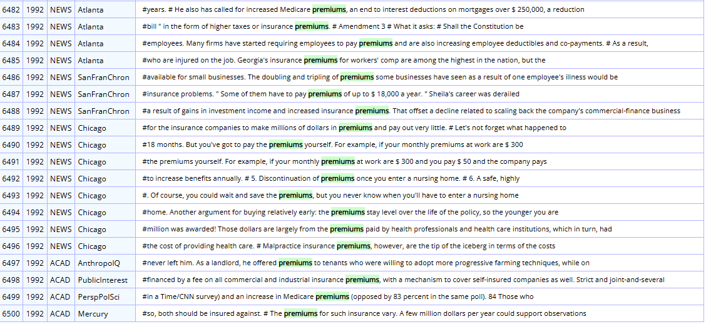

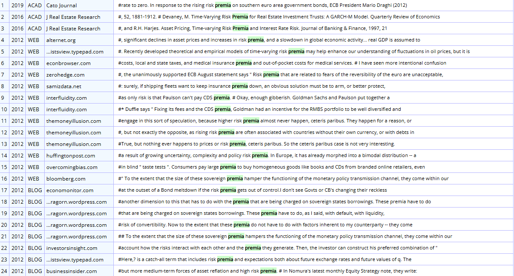

**고전형:**

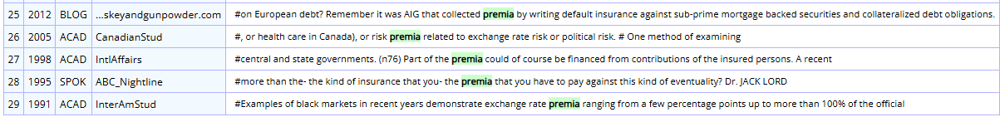

---

[← 전체 사례 목록으로](../README.md#사례-분석) · [방법론](../docs/methodology.md) · [결론 및 제언](../docs/conclusion.md)
