# referendums / referenda

> **그룹**: 공존 그룹  
> **3층위 요약**: 1차 `공존` → 2차 `우세 전환` → 3차 `register 분화`

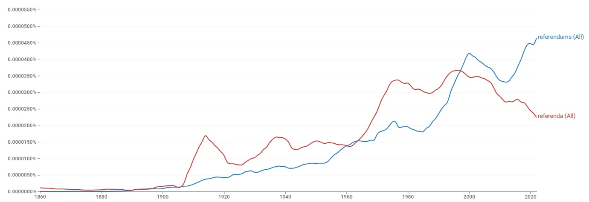

*대표 이미지: referendums / referenda Google Ngram 장기 사용량. 형용사·명사 연어 그래프와 COCA 맥락 캡처 등 나머지 이미지는 아래 [참조 이미지](#참조-이미지)에 정리했다.*

## 1. 결론

*referenda*와 *referendums*는 의미 분화를 통해 공존하는 관계라기보다, 동일한 정치적 의미 영역을 두고 경쟁하면서도 서로 다른 담화 환경에 배분되는 사례다. *referenda*는 제도적·법률적·학술적 텍스트에 상대적으로 강하게 남고, *referendums*는 동시대 정치 이슈와 결합하며 뉴스·대중 담론의 중심 형태로 확장된다. 따라서 **공존 → 우세 전환 → register 분화**에 속한다.

## 2. 연구 결과

| 층위 | 분석 축 | 결과 |
| --- | --- | --- |
| 1차 | 현재 사용 상태 | 공존 |
| 2차 | 변화의 속도·방향 | 우세 전환 |
| 3차 | 작동 메커니즘 | register 분화 |

## 3. 과정 및 결론 도달 과정 (사용 도구)

1차 **Ngram 사용량 그래프**로 초기 고전형 우세와 이후 규칙형 추월(공존)을, 2차 같은 그래프로 규칙형이 점진적으로 증가하며 **우세 전환**된 경로를 읽었다. 3차는 **Ngram 연어**(형용사·명사 모두 거의 동일)와 **COCA 맥락 분석**(고정적 제도 표현 vs 유연한 동시대 결합)으로 레지스터 분화를 해석했다.

## 4. 세부 정보 (구간 별 분절)

### 4-1. 1차 — 현재 사용 상태 (Google Ngram 사용량)

초기에는 고전형 *referenda*가 우세한 시기가 길게 이어지며 20세기 초반·1970년대 전후 상승한다. 규칙형 *referendums*는 20세기 초부터 완만히 증가해 후반으로 갈수록 확대되며, 1990년대 후반~2000년대 전후 *referenda*를 추월하고 21세기 들어 격차를 더 벌린다. 현재 두 형태는 공존하되 균형은 규칙형 쪽으로 기운다.

### 4-2. 2차 — 변화의 속도·방향

초기에 곧바로 대체된 것이 아니라, 규칙형의 사용량이 점진적으로 증가하며 그 우세가 전환된 **우세 전환**의 경로다.

### 4-3. 3차 — 작동 메커니즘 (연어 + COCA)

형용사 연어는 *national, constitutional, local, popular, public* 등으로 거의 동일하고, 명사 연어에서도 주제적 분화가 뚜렷하지 않다(*state, bond, voter, tax* 공유). 다만 *referenda*는 *initiatives and referenda* 같은 고정적 제도 표현으로 반복되는 반면, *referendums*는 *independence, devolution* 등 특정 시기의 핵심 쟁점과 유연하게 결합한다. COCA에서 *referenda*는 학술지·격식 언론의 문어적 레지스터와 화석화된 제도 표현에, *referendums*는 동시대 쟁점·은유적 용법(*elections are referendums on…*)·유연한 결합에 분포한다. 의미가 아니라 담화 환경이 갈리는 **register 분화**다.

### 4-4. 역사적 제언

*referenda*는 법률·정치학·제도적 텍스트에 상대적으로 강하게 남아 있는 반면, *referendums*는 동시대 정치 이슈와 결합하며 뉴스와 대중 담론의 중심 형태로 자리 잡아, 두 형태가 서로 다른 담화 환경에 배분되었다.

## 참조 이미지

본문에는 대표 이미지(Ngram 사용량) 1개만 두고, 아래 연어 그래프 및 COCA 맥락 캡처는 참조로 분리한다.

### Google Ngram 연어 분석

- **형용사 연어 — 규칙형**  
  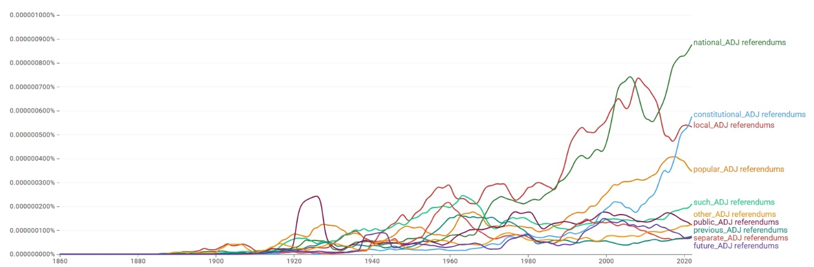
- **형용사 연어 — 고전형**  
  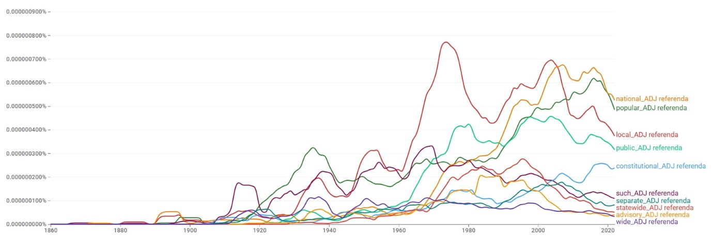
- **명사 연어 — 규칙형**  
  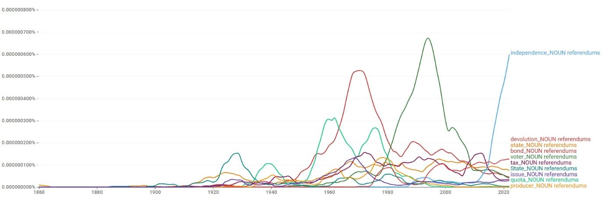
- **명사 연어 — 고전형**  
  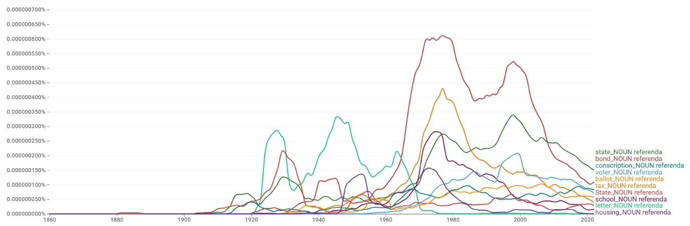

### COCA 맥락 분석

**규칙형:**

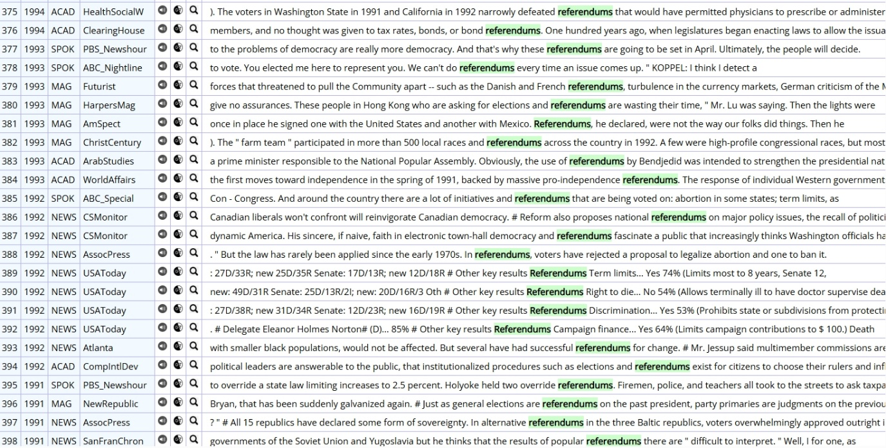

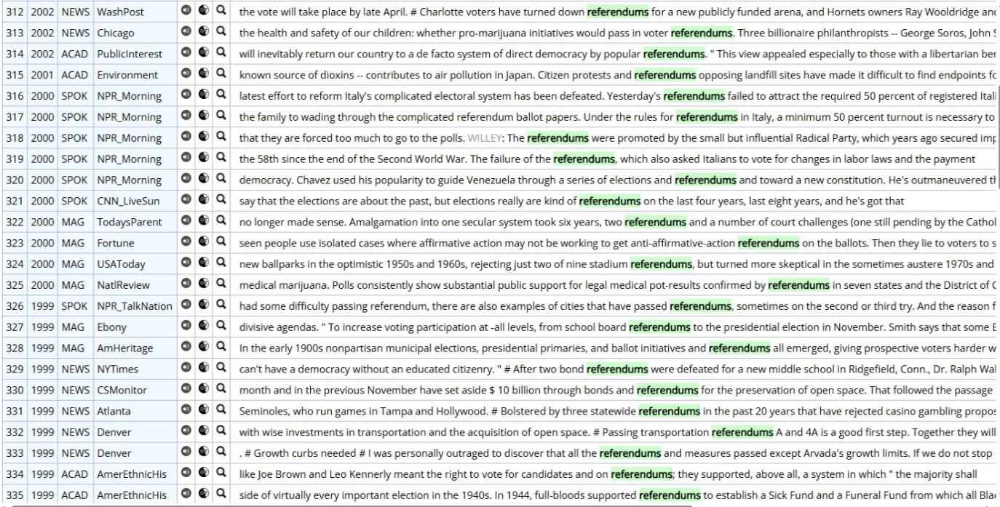

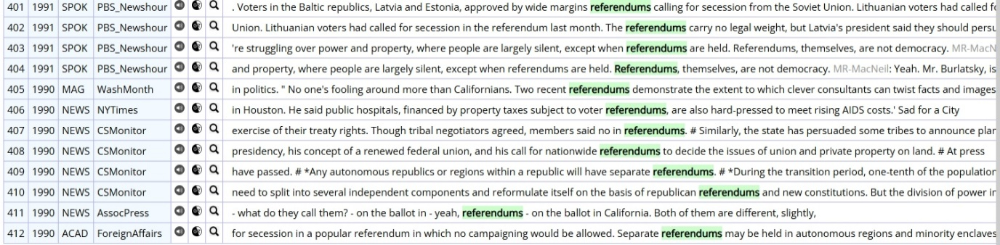

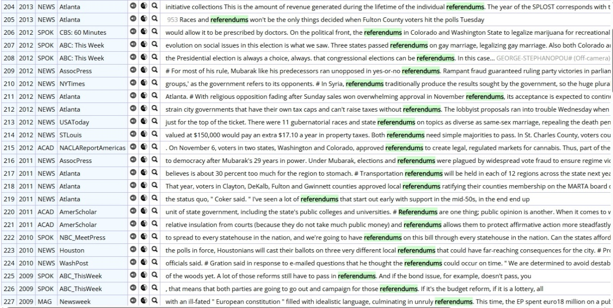

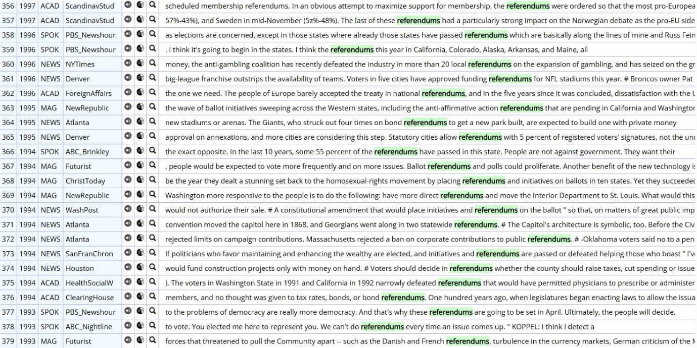

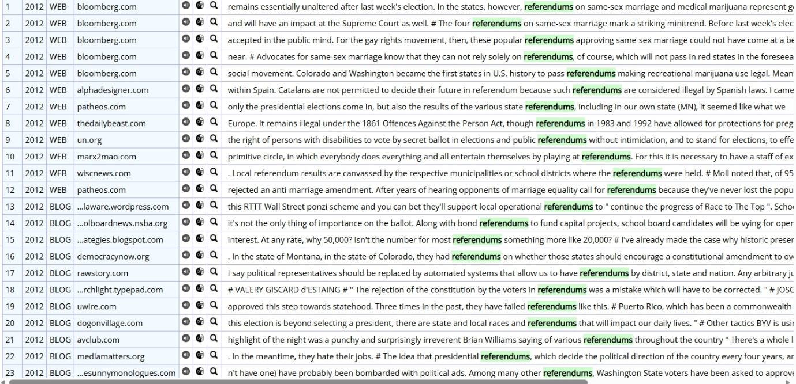

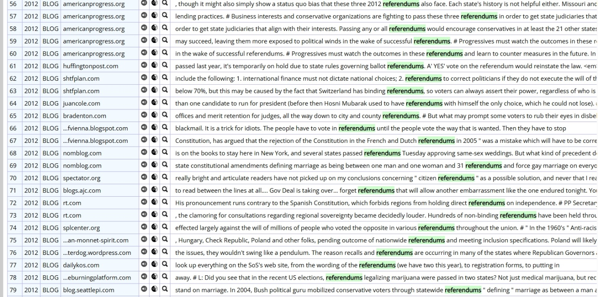

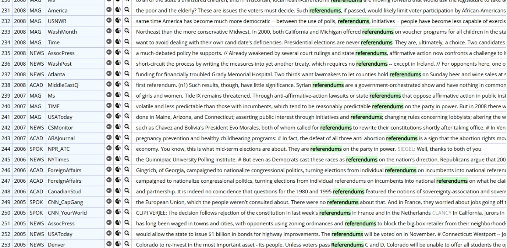

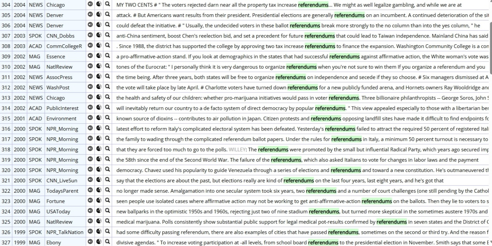

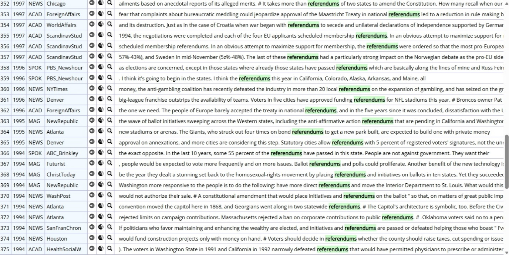

**고전형:**

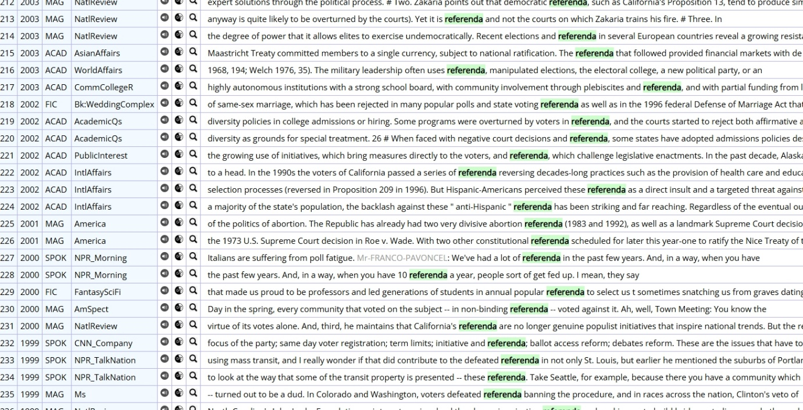

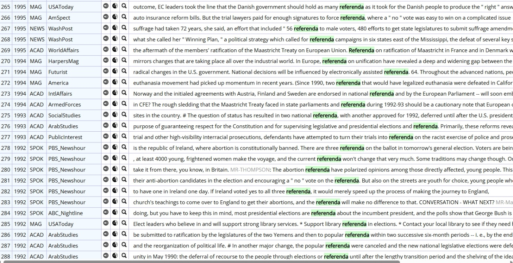

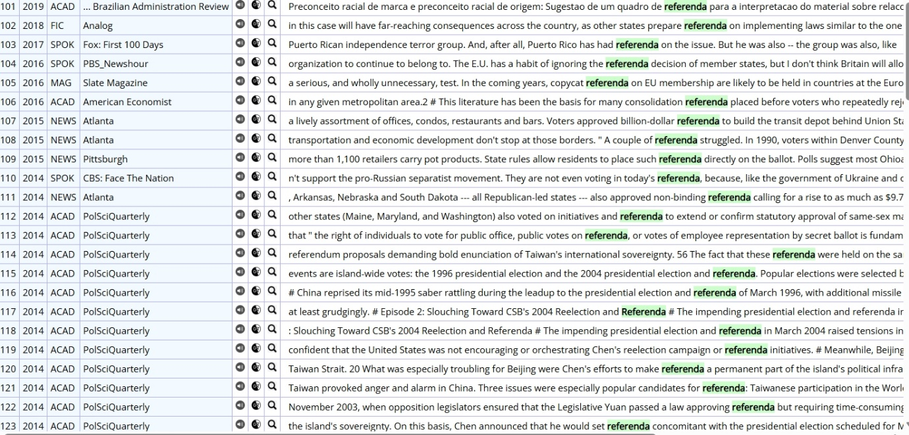

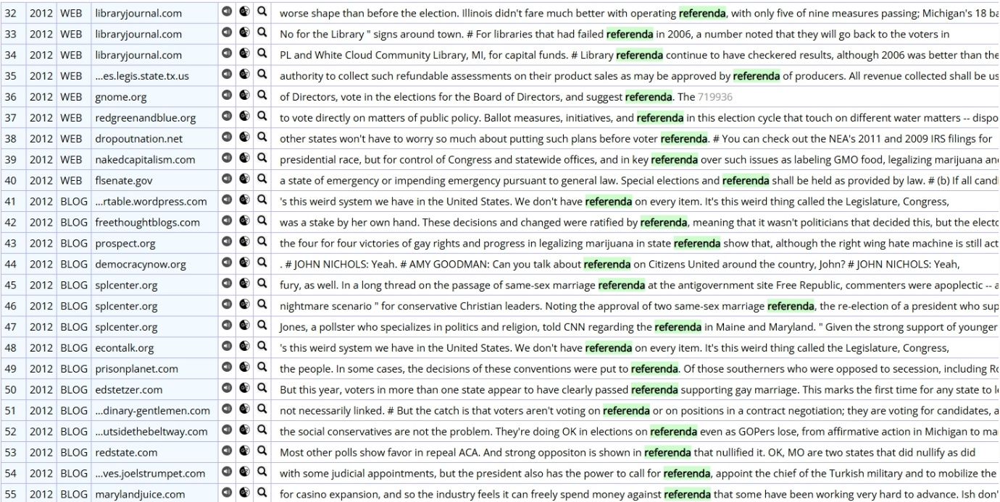

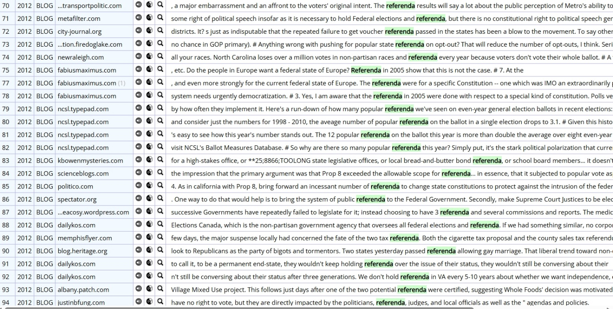

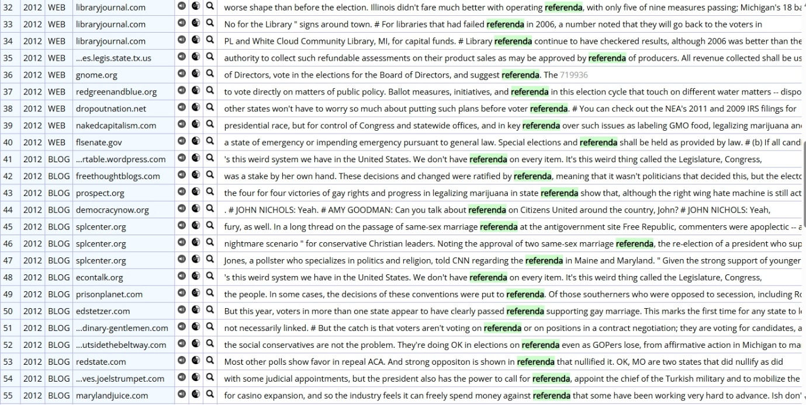

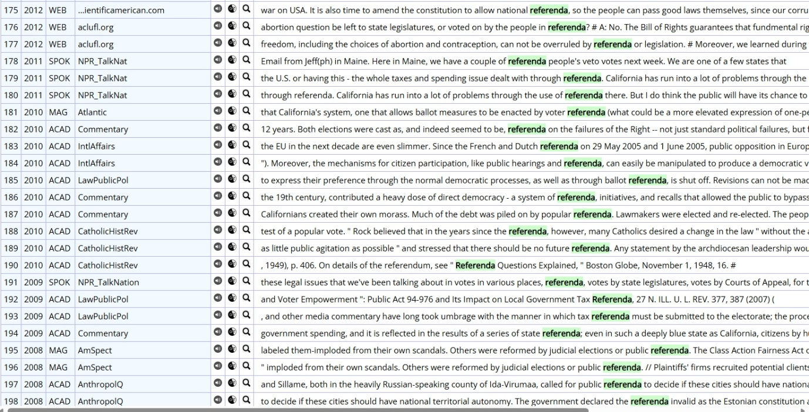

---

[← 전체 사례 목록으로](../README.md#사례-분석) · [방법론](../docs/methodology.md) · [결론 및 제언](../docs/conclusion.md)
