# syllabi / syllabuses

> **그룹**: 규칙형 우세 그룹  
> **3층위 요약**: 1차 `규칙형 우세` → 2차 `장기 경쟁` → 3차 `register 분화`

*대표 이미지: syllabi / syllabuses Google Ngram 장기 사용량. 형용사·명사 연어 그래프와 COCA 맥락 캡처 등 나머지 이미지는 아래 [참조 이미지](#참조-이미지)에 정리했다.*

## 1. 결론

*syllabi*와 *syllabuses*는 ‘강의 계획/교육과정’이라는 동일 의미 영역을 공유하면서도 서로 다른 제도적 환경에 배분된다. *syllabi*는 고등교육·학술 행정의 맥락에, *syllabuses*는 초·중등 공교육·교육청 중심의 표준화 문서 맥락에 더 강하게 결부된다. 사용 빈도의 중심이 점차 규칙형 쪽으로 이동하는 한편 두 형태가 다른 레지스터에 배분되므로, **(규칙형 우세) → 장기 경쟁 → register 분화**의 구조다.

## 2. 연구 결과

| 층위 | 분석 축 | 결과 |
| --- | --- | --- |
| 1차 | 현재 사용 상태 | 규칙형 우세 |
| 2차 | 변화의 속도·방향 | 장기 경쟁 |
| 3차 | 작동 메커니즘 | register 분화 |

## 3. 과정 및 결론 도달 과정 (사용 도구)

1차 **Ngram 사용량 그래프**로 두 형태의 위상 변화(고전형 쪽으로 기운 균형)를, 2차 같은 그래프로 **장기 경쟁과 교차**의 경로를 읽었다. 3차는 **Ngram 연어**(course/sample/university vs school/examination/grade)와 **COCA 맥락 분석**(대학·학술 행정 vs 공교육·교육청 문서)으로 제도적 레지스터 차이를 해석했다.

## 4. 세부 정보 (구간 별 분절)

### 4-1. 1차 — 현재 사용 상태 (Google Ngram 사용량)

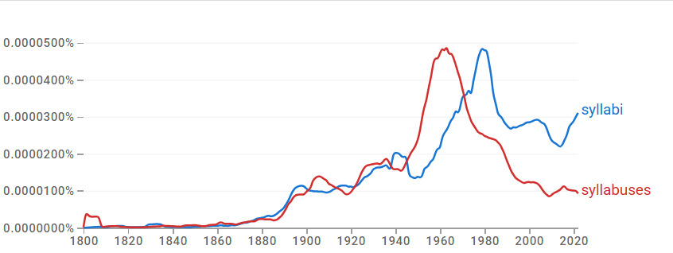

두 형태 모두 20세기 중반을 전후해 사용량이 증가한다. 초기에는 비슷한 수준에서 병행되다가, 1950년대 이후 규칙형 *syllabuses*가 급증해 1960년대 전후 정점을 기록한 뒤 빠르게 감소한다. 고전형 *syllabi*는 1960년대 후반부터 다시 상승해 1970년대 전후 *syllabuses*를 추월하고 이후 상대적으로 높은 사용량을 유지한다. 현재 두 형태는 공존하되 균형은 고전형 *syllabi* 쪽으로 기운다.

### 4-2. 2차 — 변화의 속도·방향

한 형태가 곧바로 다른 형태를 대체한 것이 아니라, **장기간의 경쟁과 교차**를 거친 뒤 한쪽이 우세를 차지하는 경로다.

### 4-3. 3차 — 작동 메커니즘 (연어 + COCA)

형용사 연어는 *new, detailed, different, various, official* 등으로 유사해 뚜렷한 의미 분화가 없다. 명사 연어에서 *syllabuses*는 *school, examination, history, mathematics, level*과 결합해 학교 교육과정·과목별 표준 체계에, *syllabi*는 *course*와의 결합이 압도적이며 *sample, university*와 함께 대학 강의·교수 임용·학사 행정에 쓰인다. COCA에서도 *syllabi*는 고등교육·학술 연구·교수 행정에, *syllabuses*는 공교육·학년별 세부 내용·교육청 하향식 지침에 결부된다. 의미가 아니라 제도적 환경이 갈리는 **register 분화**다.

### 4-4. 역사적 제언

*syllabi*는 고등교육과 학술 행정의 맥락에서, *syllabuses*는 초·중등 교육과 표준화된 교육 문서의 맥락에서 주로 사용되며, 두 형태가 서로 다른 제도적 환경에 배분되었다.

## 참조 이미지

본문에는 대표 이미지(Ngram 사용량) 1개만 두고, 아래 연어 그래프 및 COCA 맥락 캡처는 참조로 분리한다.

### Google Ngram 연어 분석

- **형용사 연어 — 규칙형**  
  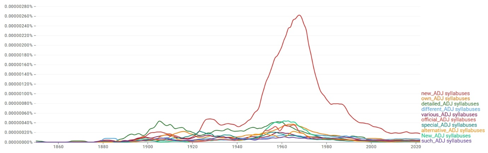
- **형용사 연어 — 고전형**  
  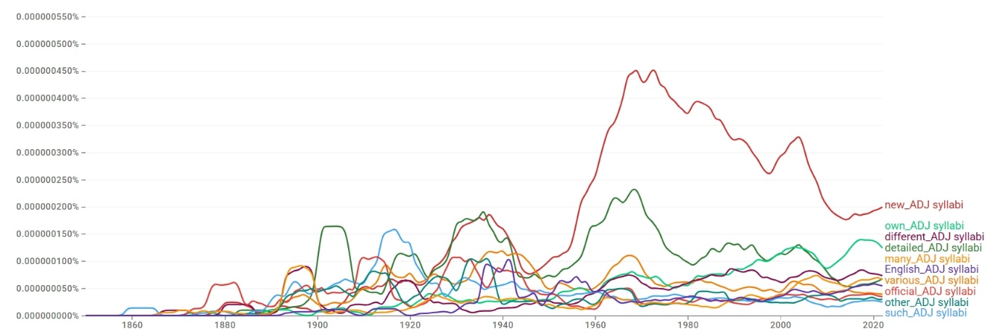
- **명사 연어 — 규칙형**  
  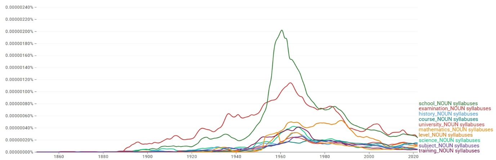
- **명사 연어 — 고전형**  
  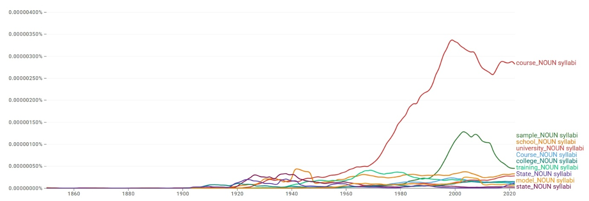

### COCA 맥락 분석

**규칙형:**

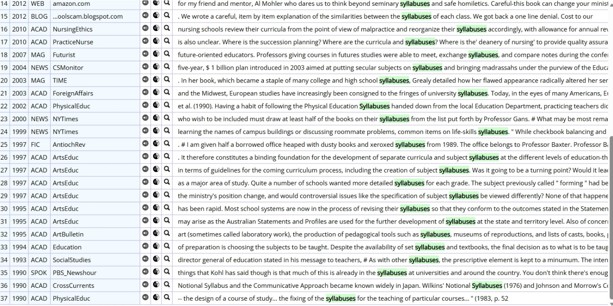

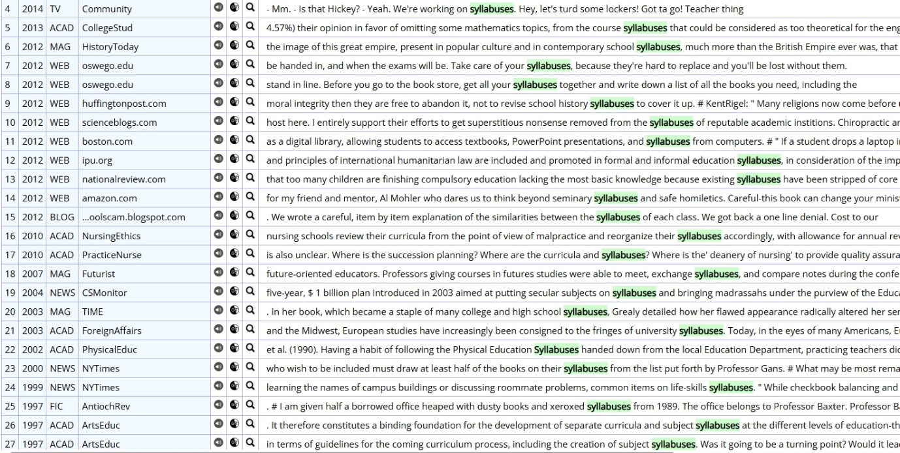

**고전형:**

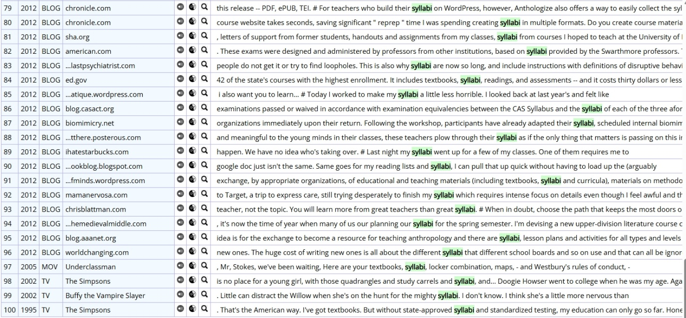

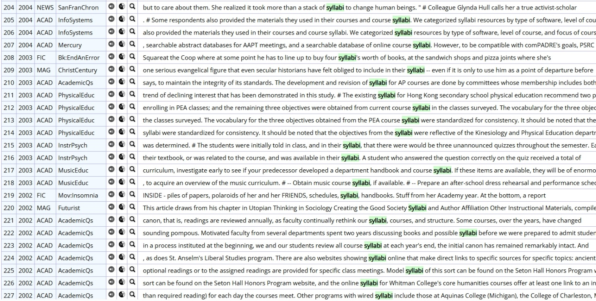

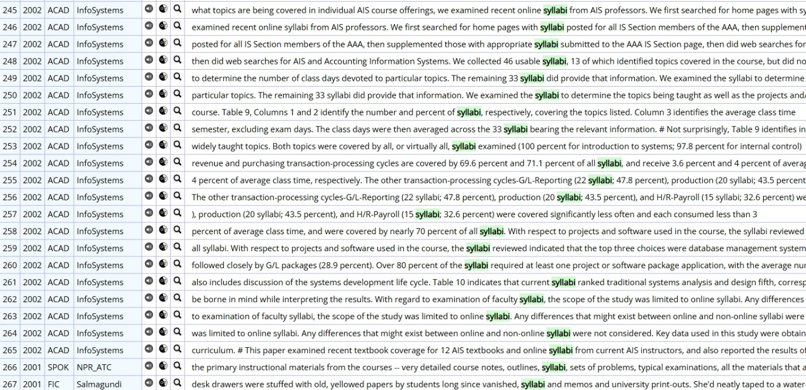

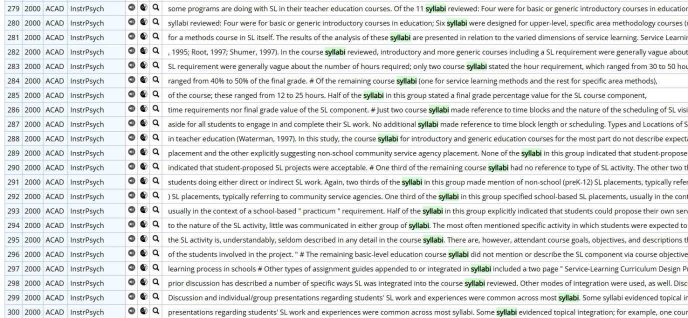

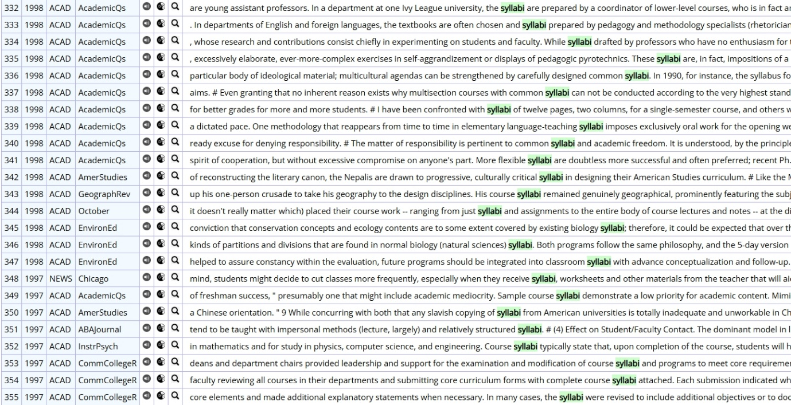

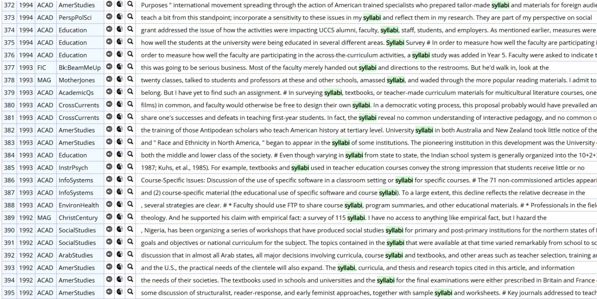

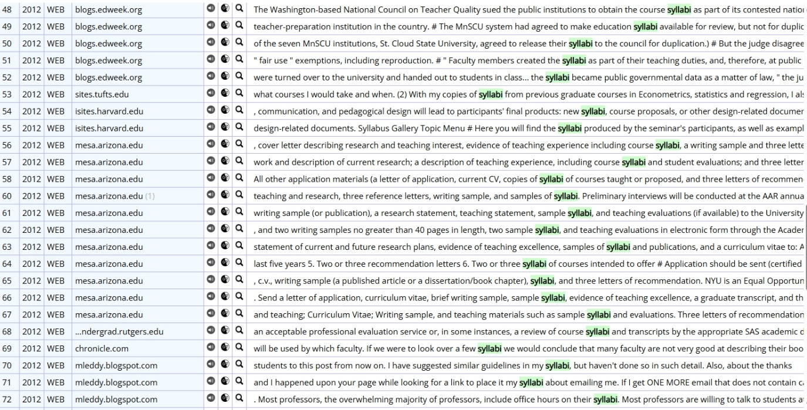

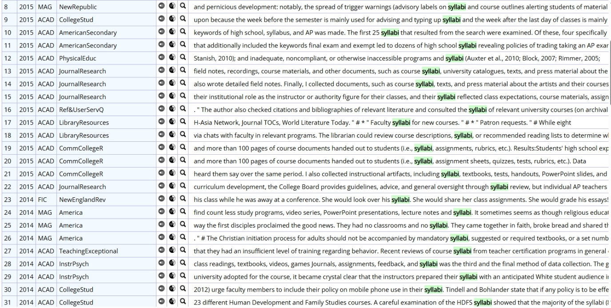

---

[← 전체 사례 목록으로](../README.md#사례-분석) · [방법론](../docs/methodology.md) · [결론 및 제언](../docs/conclusion.md)
