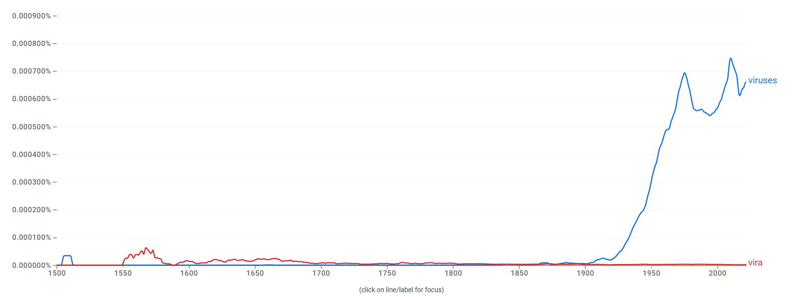
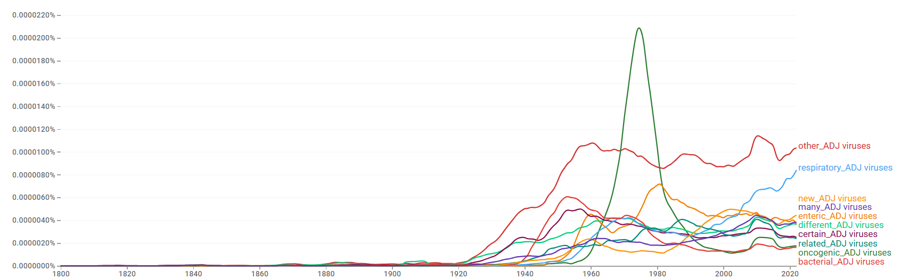
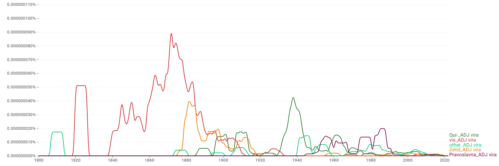
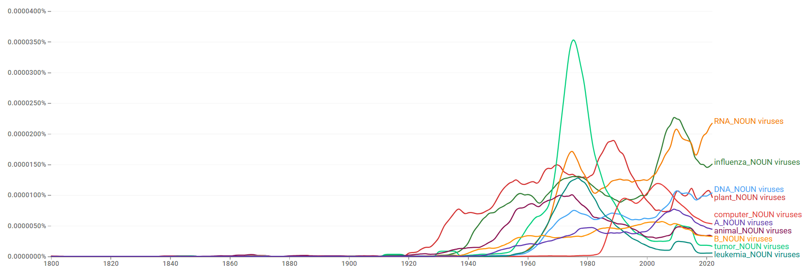
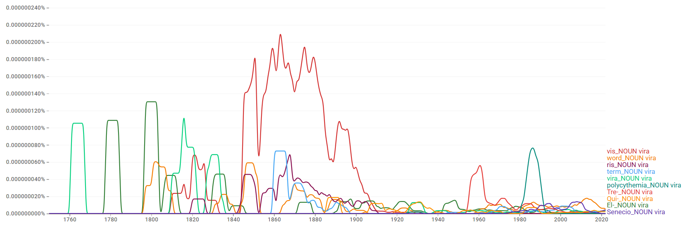
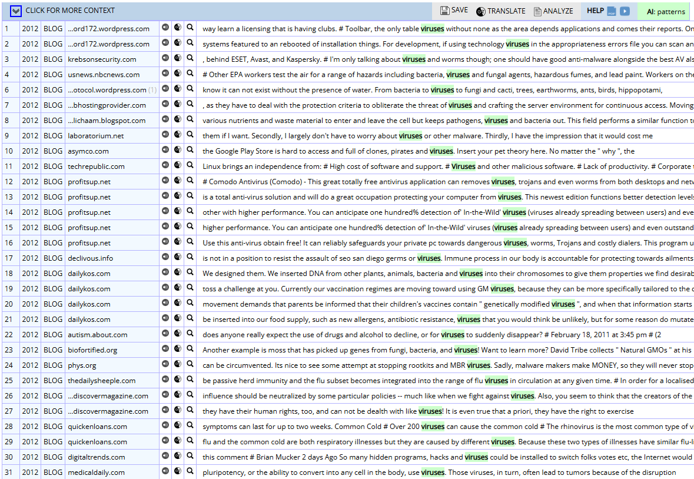
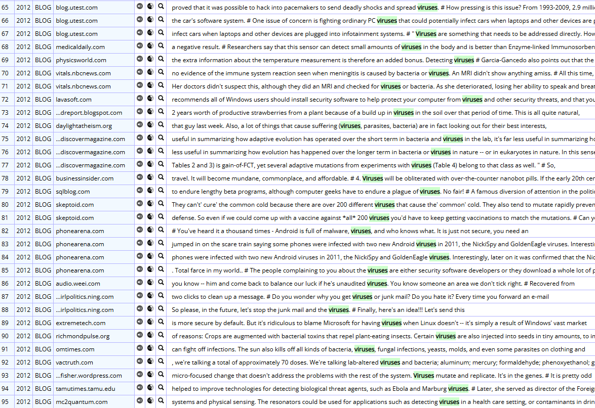
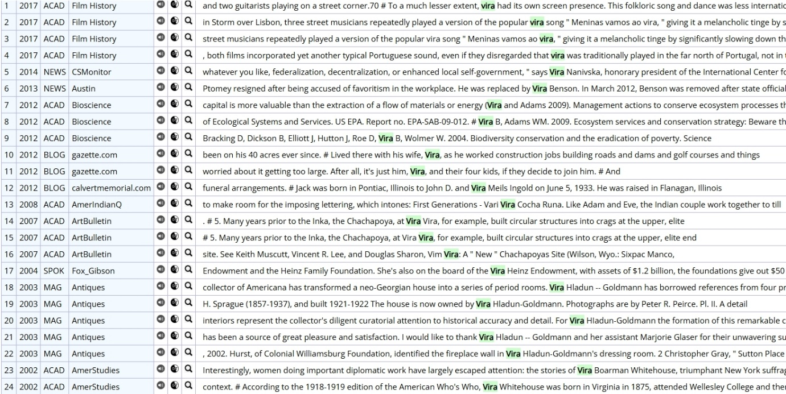

# viruses / vira

> **그룹**: 규칙형 우세 그룹  
> **3층위 요약**: 1차 `규칙형 우세` → 2차 `빠른 수렴` → 3차 `경쟁 후 소멸`

*대표 이미지: viruses / vira Google Ngram 장기 사용량. 형용사·명사 연어 그래프와 COCA 맥락 캡처 등 나머지 이미지는 아래 [참조 이미지](#참조-이미지)에 정리했다.*

## 1. 결론

*viruses*와 *vira*는 동일 의미 영역에서 기능적으로 분화된 복수형이라기보다, 현대 영어에서 서로 다른 지위를 갖는 형태다. *viruses*는 바이러스학·공중보건·의학·생물학, 나아가 컴퓨터 보안 담화까지 폭넓게 쓰이며 생산적 표준 복수형으로 확고히 자리 잡았다. 반면 *vira*는 고유명사·문화 명칭·제한적 학술 명명의 일부로만 나타날 뿐 *virus*의 실질적 고전 복수형으로 거의 기능하지 않는다. 따라서 의미·register 분화가 아니라, 규칙형이 빠르게 고착되고 고전형이 주변적으로만 잔존한 **규칙형 우세 → 빠른 수렴 → 경쟁 후 소멸**로 이해된다.

## 2. 연구 결과

| 층위 | 분석 축 | 결과 |
| --- | --- | --- |
| 1차 | 현재 사용 상태 | 규칙형 우세 |
| 2차 | 변화의 속도·방향 | 빠른 수렴 |
| 3차 | 작동 메커니즘 | 경쟁 후 소멸 |

## 3. 과정 및 결론 도달 과정 (사용 도구)

1차 **Ngram 사용량 그래프**로 규칙형의 압도적 우위와 고전형의 비가시성을 확인하고, 2차 같은 그래프로 20세기 중반 이후의 **빠른 수렴** 경로를 읽었다. 3차는 **Ngram 연어**(생물학적 결합 vs 비현대적·고유명사적 결합)와 **COCA 맥락 분석**(보안·의학·생태 vs 인명·문화명)으로 두 형태의 지위 차이를 해석했다.

## 4. 세부 정보 (구간 별 분절)

### 4-1. 1차 — 현재 사용 상태 (Google Ngram 사용량)

초기에는 두 형태 모두 매우 낮지만, 규칙형 *viruses*는 20세기 중반(특히 1940년대 후반~1970년대)에 가파르게 상승해 이후에도 높은 수준을 유지한다. 고전형 *vira*는 일부 초기 구간 외에는 거의 가시적 사용량이 없으며 현대 영어에서 생산적 형태로 기능하지 않는다. 현재 *viruses*가 사실상 압도적 우위를 점한다.

### 4-2. 2차 — 변화의 속도·방향

고전형 *vira*가 일찍 주변화된 뒤 20세기 중반 이후 *viruses*가 급격히 중심을 확립한 **빠른 수렴**의 경로다.

### 4-3. 3차 — 작동 메커니즘 (연어 + COCA)

*viruses*는 *respiratory/enteric/oncogenic/bacterial viruses*, *RNA/DNA/influenza viruses* 등과 결합하며 질병 분류·감염 경로·생물학적 특성의 핵심 용어로 기능한다. COCA에서는 컴퓨터·모바일 보안(가장 높은 비중), 의학·생물학, 생태·환경, 비유적 확산까지 폭넓게 쓰인다. 반면 *vira*는 *Qui-, vis, Zend* 등 비현대적 결합을 보이며, COCA에서는 인명(*Vira Whitehouse*), 문화 명칭(포르투갈 민속 *vira*), *Polycythemia vira* 같은 학술 명명의 일부로만 나타난다. 따라서 두 형태는 대등한 경쟁형이 아니라 **경쟁 후 소멸**에 가깝다.

### 4-4. 역사적 제언

규칙형 *viruses*는 이 단어가 현대 영어에서 가산명사로 정착하는 과정에서 처음부터 영어식 복수형을 취해 표준으로 자리 잡았으며, 고전형 *vira*는 생산적인 복수형으로 기능한 적이 거의 없다.

## 참조 이미지

본문에는 대표 이미지(Ngram 사용량) 1개만 두고, 아래 연어 그래프 및 COCA 맥락 캡처는 참조로 분리한다.

### Google Ngram 연어 분석

- **형용사 연어 — 규칙형**  
  
- **형용사 연어 — 고전형**  
  
- **명사 연어 — 규칙형**  
  
- **명사 연어 — 고전형**  
  

### COCA 맥락 분석

**규칙형:**

**고전형:**

---

[← 전체 사례 목록으로](../README.md#사례-분석) · [방법론](../docs/methodology.md) · [결론 및 제언](../docs/conclusion.md)
